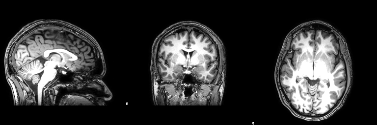
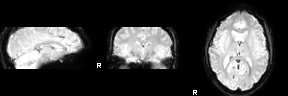

## Scanner - actual numbers from the day (2024/25)

2025-02-06, Denis Schluppeck

3 volunteers (``sub-01`` .. ``sub-03``), scanned on the 3T Philips Ingenia scanner at the SPMIC UP site. Scanner operator: AC. Start times 930h, 1015h, 1100h.

(Data available via `moodle` link to a zip file on OneDrive). 

For each person we obtained several scans. See `json` sidecar copied along for some details.

- T1w MPRAGE (1mm isotropic)
- T2w FLAIR  (1mm isotropic)
- two repeats of an fMRI experiment (`FFAlocaliser.m`); 
2.167mm inplane, 2.5mm slice thickness (so not quite isotropic), TR/TE 1500ms/30ms

