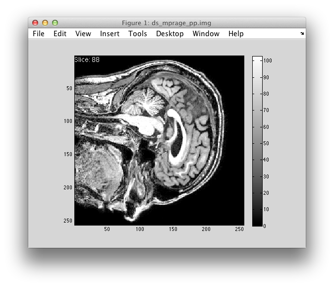
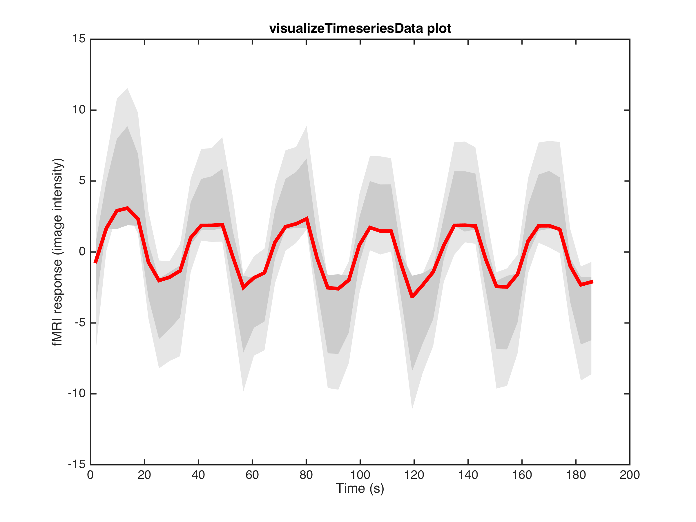

# Data analysis for Neuroimaging - C84DAN
<!-- page_number: true -->

## Overview

##### Denis Schluppeck

---

## What's the plan?

1. Acquire some functional MRI data in a simple, but real experiment
2. Analyze the data with ``fsl`` [(FMRIB webpage)](https://fsl.fmrib.ox.ac.uk/fsl/fslwiki)
3. Learn a bit about ``UNIX`` and version control, in particular ``git`` and ``github``
4. Use ``Matlab`` to inspect and visualise some data

---

## Setting up computers, logins


1. Each user (at a particular machine) needs to make sure that ``Terminal/shell`` is set up correctly by copying a set-up file the first time they use that computer.
```bash
# copy across new version of .bash_profile
cd ~ # make sure we are in ${HOMEDIR}
cp /Volumes/practicals/ds1/.bash_profile   ~/
# restart shell
```
3. Quick reality check. Look at some existing data (anatomy, fMRI) with ``fslview``

---


## Version control (v2.0) :wink:

4. Everyone should sign up for a free ``github`` account, so we can work together on this from session 4 onwards: https://github.com/join


---

## FSL analysis

- get data from sessions ``S001``to ``S004`` into a common folder ``data``
- make folders, copy files by "drag & drop"
- point & click version (like some of you have already done)
- digging into the details of how this is implemented
- inspecting analysis output, intermediate files, ...

```bash
cd ~/data/S001/  # for example
# run FSL analysis
```

---

## Some UNIX

- only basics are needed for running FSL analysis
- lots of functionality is available through point-and-click
- **but** command line is helpful for organising (any) research data
- more complex analysis, e.g. ``freesurfer``, require some working knowledge

```bash
# navigate file system
# cd, ls, pwd, which, ...

# some powerful commands for organising your data
# cp, rm, touch, mkdir, rmdir

# some stuff to show of how powerful
# grep, "lists", "wildcards (*, ., ?)"
# "regular expressions"
```

---

## Version control ``git``

- 30min [lecture on principles of version control](version-control.pdf) (``git``)
- start using your (free) ``github.com`` id by working on a simple project
- make your first modifications to a local copy of code and get it into a repo.

```bash
mkdir test && cd test # what does this do?
git init
# [[ create, edit a file, say my_first.md ]]
git add my_first.md  # add it to "staging area"
git commit # enter commit message
# - OR -
git commit -m 'adds first version of file'
git log
```

---


## ``matlab`` - reading images (1)

- we'll learn how to read imaging data into ``matlab`` (``nifti`` files) 
- functions provided by the [``mrTools`` toolbox](http://gru.stanford.edu/doku.php?id=mrTools:overview) for Matlab

```matlab
help mlrImageReadNifti

% read in some data
data = mlrImageReadNifti('file_from_scanner.nii');
```

---

## ``matlab`` - reading images (2)

- revisit indexing of arrays, "slicing", etc.

```matlab
data(12, 24, :, 1) % what is this?
data(:, 24, 24, 1) % ... and this?
data(34, 44, 12, :) % ... or that?
```

- build a ``returnSlice()`` function, to complete a simple imageviewer:

```matlab
% function signature
s = returnSlice(array, sliceNum, orientation);
```

--- 

## ``sliceview()``

<center>
	
</center>

<small>
<pre><code>Press the following buttons to:
up/down change slice
o/O 	change orientation
c/C 	change cursor
q/	Esc quit
</code></pre>
</small>


---


## ``matlab`` - timeseries and subplots

<center>
	
</center>


---


## ``matlab`` - text/csv/data 

- think about data formats / interop with other analysis & tools (``R``, ``python``, ... even UNIX tools). Sometimes a text file is best!

```matlab
% read / write delimited files
dlmread()
dlmwrite()

% basic CSV support (no header lines!)
csvread()
csvwrite()

% read in a simple CSV file, skipping first row (r=0)
% csvread(file, R, C) % row R, column C (starting at 0!)
d = csvread('timecourse.csv', 1, 0) 
```

---

## wrap-up

- what have we covered in the last 7 weeks?
- where to go to from here (unleash your inner coding :tiger:)
- try to approach each new problem, project with lots of repetition (analysis, writing, coding, ...):
	- there must be a better way!
	- what's the smallest unit that gets repeated all the time?
	- can I use ``bash/unix``, ``matlab`` or another tool to automate?
- just try things out - you'll learn tons in the process


---

## Notes

Small ``awk`` program for adding a counter ``n`` and time ``t`` and turn one column txt file into csv file:


```bash 
awk 'NF    {print NR-1 ", " (NR-1)*1.5 ", "  $1}' \
     timecourse.txt > timecourse.csv
```

- with a headerline (matlab's ``csvread()`` doesn't like!)

```bash
awk 'BEGIN {print "n, t, response"}  
     NF    {print NR-1 ", " (NR-1)*1.5 ", "  $1}' \
     timecourse.txt > timecourse.csv

     