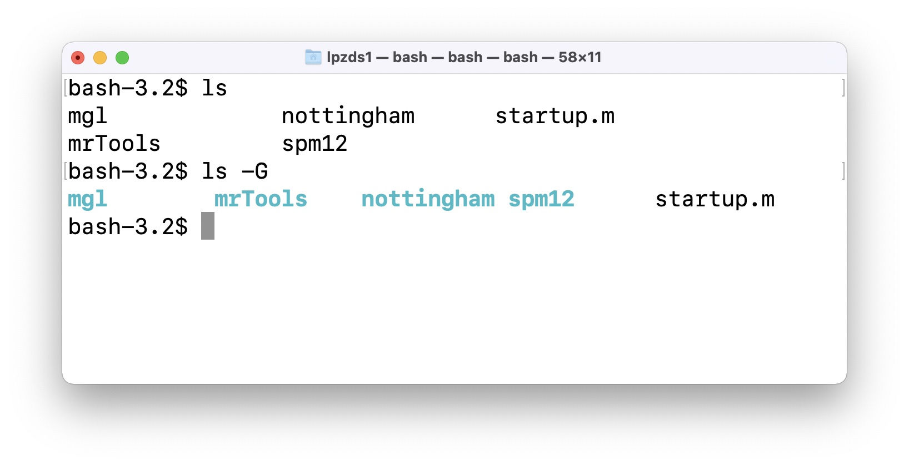
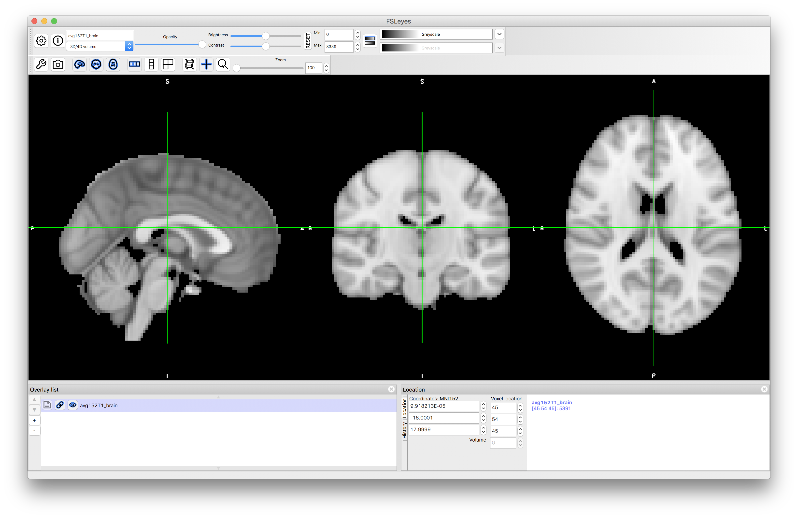

# Data analysis for Neuroimaging - PSYG4043 / C84DAN
<!-- page_number: true -->

## Overview

### Denis Schluppeck, JeYoung Jung

---

## What's the plan?

1. Acquire some [functional] MRI data in a simple, but real experiment

2. Analyze the data with two commonly used software packages ``spm`` (matlab) and ``fsl`` 

3. Learn a bit about ``UNIX``, organising data and code: version control, in particular ``git`` and ``github``

4. Use different tools to inspect and visualise data

5. [optional] anatomical, diffusion weighted +/- multi-echo data (T2*)

---

## Learning objectives

1. Build a better understanding of principles (and practice of) magnetic resonance imaging

2. Learn about state of the art analysis tools for (f)MRI

3. Appreciate usefulness of scripting, `unix`, version control for reproducibility / transparency of work

4. Discover `matlab`, toolboxes for data visualisation

---

## Timeline


| Unit     | Topic                                                         |
|:---------|:--------------------------------------------------------------|
| 1 :star: | Introduction, Administrivia, computers, ...                   |
| 2        | Data acquisition (**scanning on 3T at SPMIC**)                |
| 3        | Inspecting & analysing data in **SPM**                        |
| 4        | **FSL** + Version control (``git`` and ``github.com``)                  |
| 5        | Images in **Matlab**, display, analyze                        |
| 6        | Timeseries signals in **Matlab**                              |
| 7        | **wrapup** + Reading/writing text, CSV, data files **Matlab** |

---

## What's the assignment?

### A short, written report

> Summarise the experimental setup, analysis methodology and results. Need to have clearly written abstract (250w), methods, results and discussions (and **figures**).

**Aim:** Get you thinking about journal-style writing, rather than essays. Plus: presenting your own data, identifying key points, a story/pitch.

---

#### When to work on this? :construction_worker:

Start as soon as we have the data
- explore your analysis ideas
- talk to us about questions you could address
- think about plots + data visualisations you'd like to make

#### Submission details :paperclip: :books:

Currently w/ Student Services, *date to-be-confirmed*

- turn-it-in submission on moodle page
- **deadline: end of March** (the week after last class of this module - check moodle page for details)

---

## What's the assignment (2) :bar_chart: :chart_with_upwards_trend: :chart_with_downwards_trend:

- 250w abstract
- plus a main document (max 1500w)
- references / citations as for standard written work
- **max 5 figures<sup>1</sup>** illustrating
  - details of the experimental setup
  - analysis methodology
  - results

<hr>
<small>
<sup>1</sup>figures can have sub-panels or subplots
</small>

---

## :exclamation: For next time (lab 2)

- sign up for 1 of 3 groups (max 7 people) - ``moodle``
- complete visitor screening form
- we also need a volunteer (~40 min in scanner)

---

## Setting up computers, logins

Let's check log-ins and make sure we can find:

- Terminal
- Matlab & set up paths for SPM

---

## Note

Each user (at a particular machine) needs to make sure that ``Terminal/shell`` is set up correctly – if you move machines between labs (or want to do things elsewhere, repeat the above step!)

---

## Set up colors in terminal


```bash
alias ls='ls -G'

# or append to bash_profile
echo "alias ls='ls -G'" >> ~/.bash_profile
```



 in Terminal :heavy_check_mark:

---

## Has setup worked? `fsl`

Look at some existing anatomies with ``fsleyes`` :heavy_check_mark:

```bash
which fsl # see anything?

fsleyes & # File -> Add Standard -> Pick 1st or 2nd
```

---
##  do you see




---

## SPM/FSL analysis

- get data from sessions ``S001``to ``S004`` into a common folder ``data``
- make folders, copy files by "drag & drop"
- point & click version (like some of you have already done)
- digging into the details of how this is implemented
- inspecting analysis output, intermediate files, ...

```bash
cd ~/data/S001/  # for example
# run SPM analysis in matlab (JJ)
# run FSL analysis (DS)
```

---

## Some UNIX

- only basics needed for running ``fsl``
- lots of functionality is available through point-and-click
- **but** command line is helpful for organising data!
- more complex analysis, e.g. ``freesurfer``, require some working knowledge

```bash
# navigate file system
# cd, ls, pwd, which, ...

# some powerful commands for organising your data
# cp, rm, touch, mkdir, rmdir

# some stuff to show of how powerful
# grep, "lists", "wildcards (*, ., ?)"
# "regular expressions"
```

---

## Version control ``git``

- 30min [lecture on principles of version control](version-control.pdf) (``git``)
- start using your (free) ``github.com`` id by working on a simple project
- make your first modifications to a local copy of code and get it into a repo.

```bash
mkdir test && cd test # what does this do?
git init
# [[ create, edit a file, say my_first.md ]]
git add my_first.md  # add it to "staging area"
git commit # enter commit message
# - OR -
git commit -m 'adds first version of file'
git log
```

---


## Version control (v2.0) :wink:

Everyone should sign up for a free ``github`` account, so we can work together on this from session 4 onwards: https://github.com/join

- it's free and useful
- we'll want to play with this in lab #4
- once you have an username (pick one that I will recognise!), go to our github classroom ... details to follow

---

## ``matlab`` - reading images (1)

- we'll learn/revisirt how to read imaging data into ``matlab`` (``nifti`` files)

```matlab
% > R2017b
data = niftiread('file_from_scanner.nii');
```

---

## ``matlab`` - reading images (2)

- revisit indexing of arrays, "slicing", etc.

```matlab
data(12, 24, :, 1) % what is this?
data(:, 24, 24, 1) % ... and this?
data(34, 44, 12, :) % ... or that?
```

- we built a ``returnSlice()`` function, to complete imageviewer:

```matlab
% function signature
s = returnSlice(array, sliceNum, orientation);
```
- some more coding along these lines


---

## ``makeMontage('dafni_01_anatomy.nii', 25)``

<center>

</center>
<small>
<pre><code>function [  ] = makeMontage(fname, nSamples)
%makeMontage - make a montage from 3d/4d image
</code></pre>
</small>

---

## ``matlab`` - timeseries and subplots

<center>

</center>


---

## Using toolboxes to visualise data (JJ)

- glass brains
- SPMs, cluster maps on anatomical images.
- cut-aways, ...


---

## Wrap-up (Lab 7)

- recap what have we covered in the last 7 weeks?
- where to go to from here (unleash your inner coding :tiger:)
- try to approach each new problem, project where you find lots of repetition (analysis, writing, coding, ...):
  - there must be a better way!
  - what's the smallest unit that gets repeated all the time?
  - can I use ``bash/unix``, ``matlab`` or another tool to automate?
- just try things out - you'll learn tons in the process


---

## For next time

- make sure you complete screening form (and/or get in touch with any concerns)

- to volunteer for a scan, send me an e-mail: <a href="mailto:denis.schluppeck@nottingham.ac.uk?subject=SPMIC-scanning,%202022-10-07">denis.schluppeck@nottingham.ac.uk</a>  

- next week: see you at `SPMIC` for your timeslot - if you don't know where on campus, google `SPMIC`... first hit is imaging centre w/ directions

---

# Random technical stuff

Some notes of manipulating text files in the shell (using `awk`) and (viz timing files, etc.)

---

## Notes - text hacking in shell

Small ``awk`` program for adding a counter ``n`` and time ``t`` and turn one column `txt` file into `csv` file:


```bash
awk 'NF {print NR-1 ", " (NR-1)*1.5 ", "  $1}' \
     timecourse.txt > timecourse.csv
```

- with a headerline (matlab's ``csvread()`` doesn't like!)

```bash
awk 'BEGIN {print "n, t, response"}
     NF    {print NR-1 ", " (NR-1)*1.5 ", "  $1}' \
     timecourse.txt > timecourse.csv
```

---

### Solution in ``matlab``?

Turn ``timecourse.txt`` (column of y-values), into ``timecourse.csv``:
- where first column is a counter that goes from ``1...n``, 
- the second column is ``t`` (in s), which goes up from ``0..1.5s..`` and
- the third column is the ``y`` values

### What about something else?
- `Excel`? `R`? Another cool idea that's worth having in your set of tools?