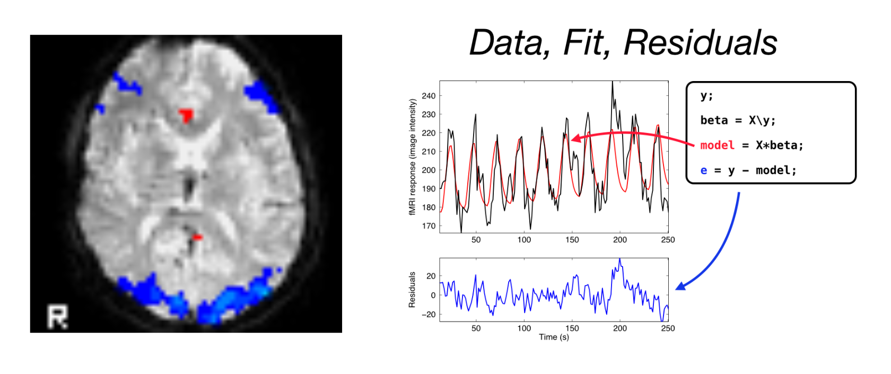

# Notes for PSYG4043/C84DAN - Data analysis for Neuroimaging

 

## Summary

These are the materials for a *data analysis for neuroimaging* module [PSYG4043] at the University of Nottingham, a core module on the *MSc Cognitive Neuroscience*.

In the class, we acquire various MRI data sets - (emphasis on fMRI, anatomical, and/or DTI) in small groups. We then use a combination of tools to analyse the data.

The module is for *10 credits* and runs for seven 2h sessions. (First iteration of the course Feb. 2017).

---

| Week | Unit                                       | Topic                                                      |
| :--- | :----------------------------------------- | :--------------------------------------------------------- |
| 1    | [Introduction](Introduction.md)            | Introduction, Administrivia, computers, ... (DS            |
| 2    | [Getting data](gettingData.md)             | Data acquisition (sessions on 3T Achieva)   (DS)           |
| 3a   | [Organising your data](organising-data.md) | Organising data (folders, meta-data, etc)                  |
| 3b   | [UNIX + git](unix-2-and-versions.md)       | Version control, some cool nitty-gritty                    |
| 4    | [FSL analysis](firstAnalysis.md)           | Inspecting & analysing data in FSL                         |
| 5    | [SPM analysis](spmAnalysis.md)             | Alternative ways of inspecting & analysing data: SPM  (JJ) |
| 6    | [Visual display](visual-display.md)        | displaying fMRI results with different toolboxes (JJ)      |
| 7    | [Wrap-up](wrap-up.md)                      | Module wrap-up and preparing for the assignment            |

---

## Assignment

The coursework **assignment** is a short written report. For details, see the moodle page for this module. In brief:

- 250w abstract
- plus a main document (max 1500w)
- references / citations as for standard written work (these don't add to the wordcount)
- max. 5 figures illustrating details of the experimental setup, analysis methodology and results (figures can have sub-panels or subplots)

For more details have a look at [this page in the `assignment` folder](assignment/Readme.md).

---

## Links

- for reading: [Data analysis for Neuroimaging (web)](https://schluppeck.github.io/dafni/)
- for getting code and using!: [DAFNI Github repo](https://github.com/schluppeck/dafni/)

## Contacts (2021/22)

- Denis Schluppeck, [@schluppeck](https://twitter.com/schluppeck)
- Jeyoung Jung, jeyoung.jung@nottingham.ac.uk

## Contacts (2019/20)

- Denis Schluppeck, [@schluppeck](https://twitter.com/schluppeck)
- Kuan (Anthony) Beh (TA)

## Contacts (2018/19)

- Denis Schluppeck
- Kuan (Anthony) Beh (TA)
