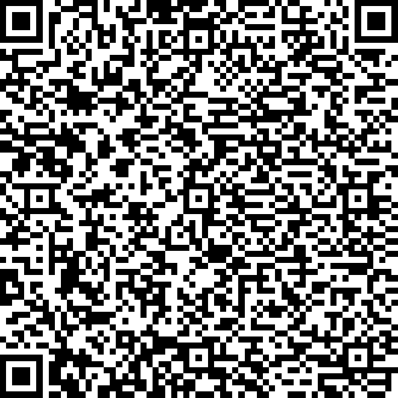
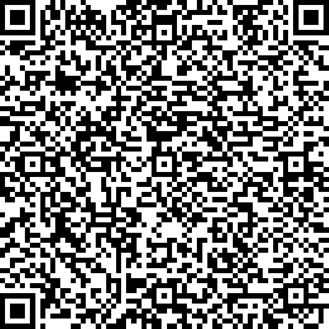
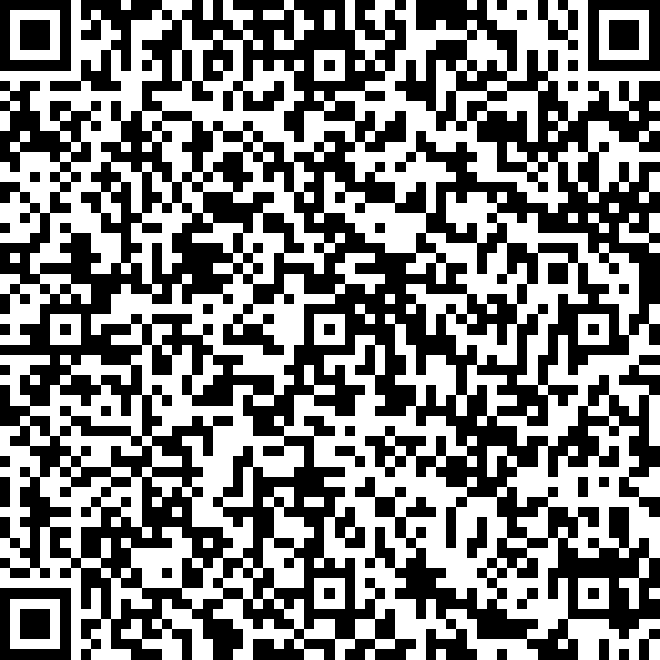
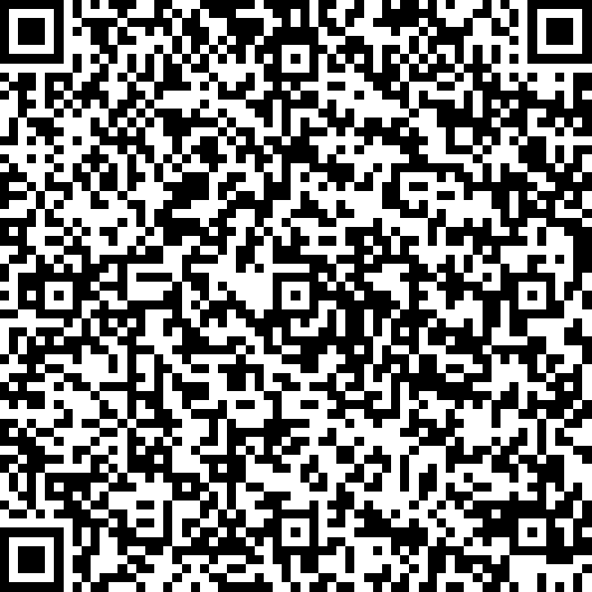
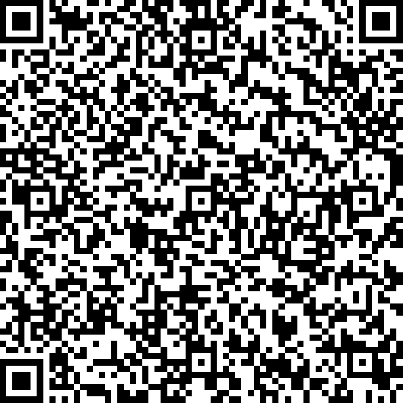
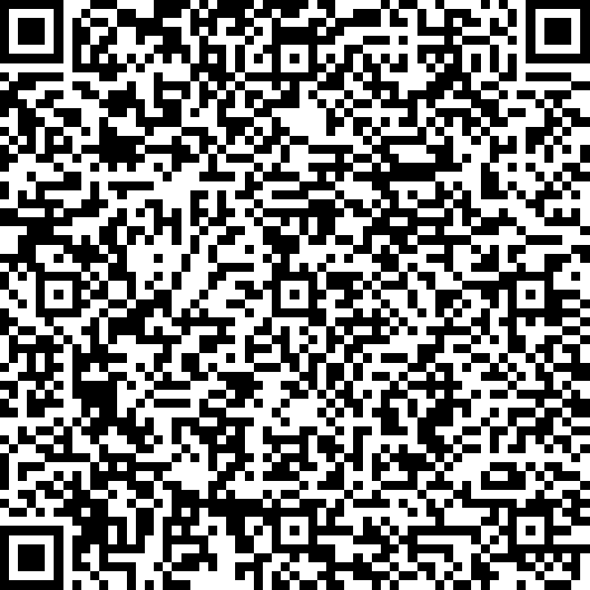
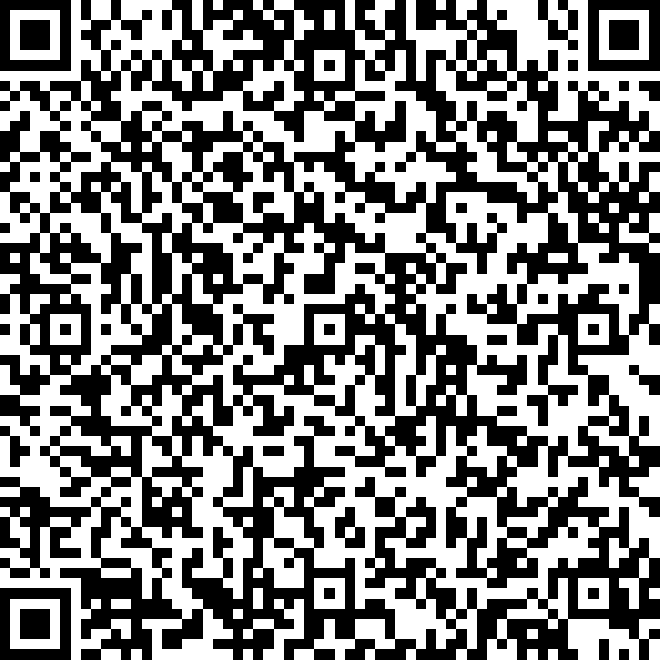

# QR code for attendance

For each session, please use the appropriate QR code to log in for attendance monitoring.

Thanks

## 2022-01-31-qr

 

  

## 2022-02-07-qr

 

  

## 2022-02-14-qr

 

  

## 2022-02-21-qr

 

  

## 2022-02-28-qr

 

  

## 2022-03-07-qr

 

  

## 2022-03-14-qr

 

  
