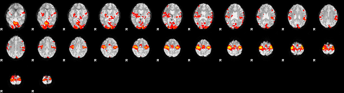

# First analysis (FSL, UNIX, ...)

The aim of this session is to analyze the data we acquired with 3T functional MRI in our simple cognitive neuroscience experiment.

In outline, the first steps will be very similar to what you may remember from another course (C84FIM), where we had a demonstration & walk-through of a simple data sets.

## Can we make to this, today?

<center>

</center>

---

[Have a look at the PDF](c84fim-workshop-01.pdf) to refresh your memory.

The **plan for here is**:

0. copy data across to a directory in your space
1. organise data in folders
2. start up ``Feat_gui &``
3. provide all the necessary info in the GUI interface
4. hit ``Go!`` and watch for progress in web browser
5. dig around in the resulting folders and files


## Organise the data into folders

Do this "by hand" - using mouse clicks in the macOS operative system for now. We'll see how to use command line calls in the Terminal soon. Think about which files are:

- functional data
- anatomical images
- "metadata" - [wikipedia entry on this idea](https://en.wikipedia.org/wiki/Metadata)

**Take 2 minutes with your neighbours to discuss the following**

- [ ] How can you tell (in words?)
- [ ] What tools / commands could you choose to check / inspect?
- [ ] What are good ways to keep track of some key information? In the same place? Somewhere else? What are the advantages / disadvantages of those options?

## Create a directory in your home

```bash
# first an "umbrella" folder, then one for subject 2
mkdir ~/data/
mkdir ~/data/subject-A/

# navigate into data directory
cd ~/data/subject-A/

# COPY the files from
# /Volumes/practicals/ds1/2020-dafni/subject-A
# TO here (.)
#
# HOW?
```

## Some initial steps / warm-up

1. Orient the MPRAGE image into the "standard" orientation that most tools will expect. This is not always necessary, but if there are issues with "alignment" in your fMRI analysis, this step can help:

```bash
# navigate into data directory
cd ~/data/subject-A/

# identify the MPRAGE image.
# mine is: ` ???  `

fslreorient2std *sMPRAGE*.nii  mprage

# if you want to skipt this step, you could also just move / rename
immv *sMPRAGE*.nii mprage
```

2. skull strip that anatomy

```bash
# inspect, if ok, then skull strip and also make a  mask (-m)
bet mprage mprage_brain -m
```

3. look at the images using `fsleyes`

## Set up the analysis using the GUI

Start up ``feat`` either via the ``fsl`` menu or directly.

```bash
# navigate into data directory
cd ~/data/subject-A/

# then pick FEAT FMRI analysis
fsl &
# - OR -
Feat_gui &
```

### Key information

- What is the name of the **4D data** set?
- Check **total volumes** and **TR** are picked up correctly.
- Consider all the options in the **Pre-stats** tab.
- **Registration.** We to register to a **Main structural image** as well as into **Standard space**.
- if you use the ``BBR`` method you need to use the `_brain.nii` image we made in a previous step. This method is pretty cool, but if not given the right files it tends to run for a _long_ time [viz **infinite**].
- **Stats.** We want to specify a full model. To do this, we need to use the ``face/object/scene.txt`` files here
  - [face.txt](face.txt)
  - [object.txt](object.txt)
  - [scene.txt](scene.txt)

## Eye candy

Register onto a nicer image:

```bash
# the renderhighres tool!
# get minimal help:
renderhighres

# actually run it:
renderhighres *.feat highres highres 1
```

You can then look inside the ``hr`` directory and look at the files called ``rendered_thresh_zstat``.
