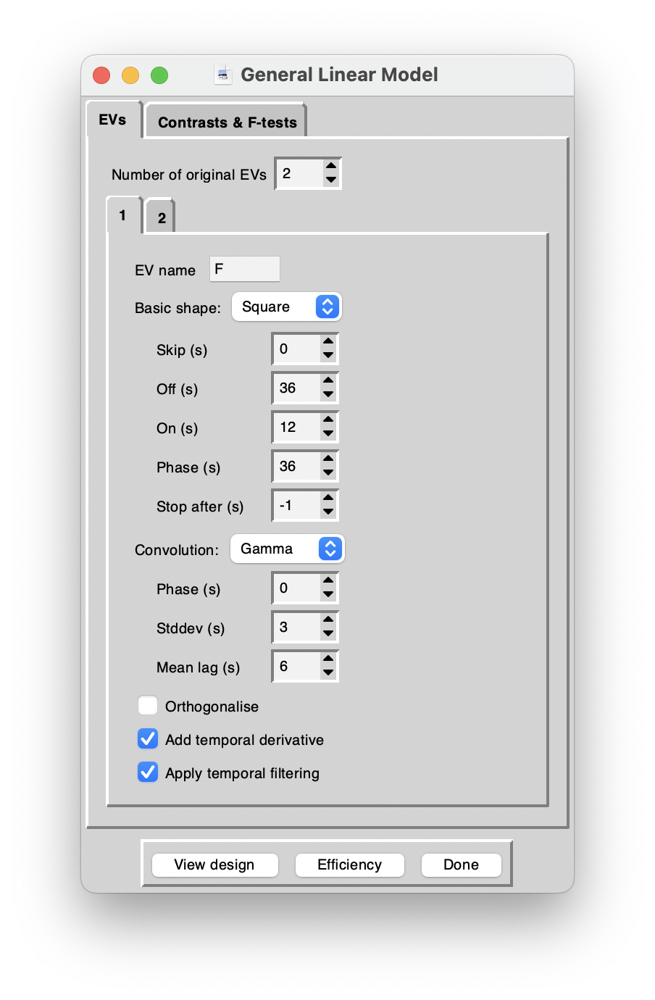
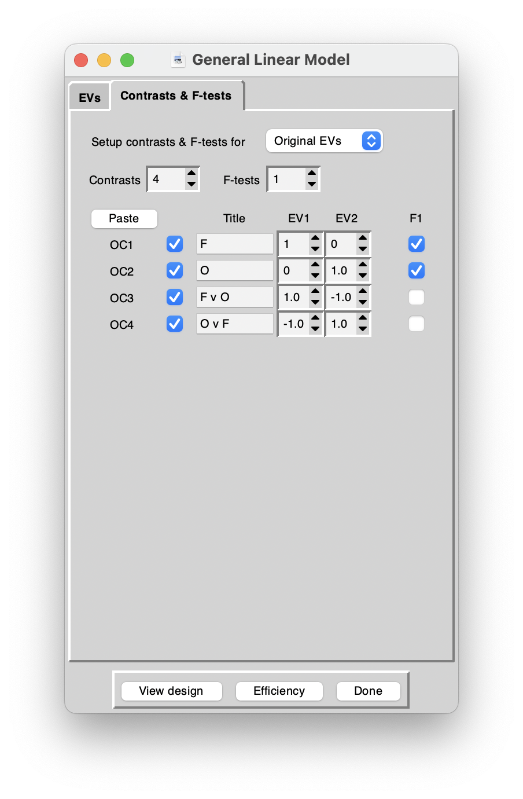

# First analysis (FSL, UNIX, ...)

The aim of this session is to analyze the data we acquired with 3T functional MRI in our simple cognitive neuroscience experiment.

In outline, the first steps will be very similar to what you may remember from another course (PSGY4020, Methods), where we had talked through the pre-processing and analysis of a simple data set with FSL.

## Can we make to this, today?

<center>

</center>

What is it? the Faces versus objects scan? or the Fingertapping. What do you think?

---

The **plan for here is**:

0. copy data across to a directory in your space
1. organise data in folders
2. start up ``Feat_gui &``
3. provide all the necessary info in the GUI interface
4. hit ``Go!`` and watch for progress in web browser
5. dig around in the resulting folders and files


## Organise the data into folders

Do this "by hand" - using mouse clicks in the macOS operative system for now. We'll see how to use command line calls in the Terminal soon. Think about which files are:

- functional data
- anatomical images
- "metadata" - [wikipedia entry on this idea](https://en.wikipedia.org/wiki/Metadata)

**Take 2 minutes with your neighbours to discuss the following**

- [ ] How can you tell which files refer to which data  (in words?)
- [ ] What tools / commands could you choose to check / inspect? `fsl` has command line tools
- [ ] What are good ways to keep track of some key information? In the same place? Somewhere else? What are the advantages / disadvantages of those options?

## Analysis steps

### Create a directory in your home, move data
 
 [The OneDrive location of the zip-file (2023/24)](https://tinyurl.com/2024-msc-data)
 -- this will only work for people who have a University of Nottingham User ID. If you haven't already downloaded these data, do so now and keep track of where the data get stored (`~/Downloads` ?)


>~~[The OneDrive location of the zip-file 2022](https://uniofnottm-my.sharepoint.com/:u:/g/personal/denis_schluppeck_nottingham_ac_uk/EXKeZytRmJxOlJ0qX_152lABI9ElAZoMzfXtFYkiajdeMw?e=sd7cW5?download=1)~~


```bash
# first an "umbrella" folder, then one for subject 2
mkdir ~/data/
mkdir ~/data/sub-03/

# navigate into data directory
cd ~/data/sub-03/

# COPY the files from
# ~/Downloads/msc-scan/sub-03
# TO here (.)
#
# HOW?
```

### Some initial steps / warm-up

### Re-orient the MPRAGE 

Orient the MPRAGE image into the "standard" orientation that most tools will expect. This is not always necessary, but if there are issues with "alignment" in your fMRI analysis, this step can sometimes help:

```bash
# navigate into data directory
cd ~/data/sub-03/

# identify the MPRAGE image. Use Readme.md or info in json files?
# could use unix `grep` ! [slightly advanced...]
# mine is: ` ???  `

fslreorient2std NAME_OF_MPRAGE_FILE.nii  mprage

# if you want to skipt this step, you could also just cp / rename
imcp NAME_OF_MPRAGE_FILE mprage

# what's the benefit of doing this renaming step / can you see issues?
```
For our 2022/23 data... the reconstructed files are already in standard space, so the `fslreorient2std` call will do nothing, really.

<details>
    <summary>Hints on finding filename with <code>grep</code></summary>
    The <code>grep</code> utility has several flags that can be useful... use <code>man grep</code> or a judicious google search to help find out how.
</details>

<details>
    <summary>flags for <code>grep</code></summary>
    Look at this <a href="https://stackoverflow.com/a/49190771/4961292">stack overflow post</a>.
</details>

<details>
    <summary>Finally... try this:</summary>
    <code>grep MPRAGE *.json</code><br>
    <code>grep -i mpRaGe *.json</code><br>
    <code>grep -i -l mpRaGe *.json</code><br>

    and there is even a way to capture / save this information, filename... but that's for another time.
</details>


<br>
2. skull strip that anatomy

```bash
# inspect, if ok, then skull strip and also make a  mask (-m)
# for the 2023/24 data, we should also use the -B option (!)
bet mprage mprage_brain -m -B
```

3. look at the images using `fsleyes`

4. What do you think the following call does. Think about it first, then run it.:

```bash
fsleyes mprage mprage_brain -cm red-yellow &
```

Any comments about what you see for this particular step?


## Set up the analysis using the GUI

Start up ``feat`` either via the ``fsl`` menu or directly.

```bash
# navigate into data directory
cd ~/data/sub-03/

# then pick FEAT FMRI analysis
fsl &
# - OR -
Feat_gui &
```

### Key information

- What is the name of the **4D data** set? There were two different experiments (a visual and a motor one). How can you tell which one was which?
- Check **total volumes** and **TR** are picked up correctly.
- Consider all the options in the **Pre-stats** tab.
- **Registration.** We to register to a **Main structural image** as well as into **Standard space**.
- if you use the ``BBR`` method you need to use the `_brain.nii` image we made in a previous step. This method is pretty cool, but if not given the right files it tends to run for a _long_ time [viz **infinite**].
- **Stats.** We want to specify a full model. To do this, we need to use the timing information from the experiment. **Can you remember what this was?**
- Let's use the **Model Setup Wizard** button, as our experimental design nicely fits one of the pre-prepared options. Timing??


#### Explanatory variables

For FSL design matrix rules, this means for two EVs and "square wave" settings, you can use the following. I called the two EVs "faces" and "objects". You can use F and O instead -- the calculations will be the same, just the naming in figures, data will obviously be different.

| setting     | Faces  | Objects |
| :---------- | :----- | :------ |
| Skip        | 36     | 36      |
| Off         | 36     | 36      |
| On          | 12     | 12      |
| Phase       | **36** | **12**  |
| Stop After  | -1     | -1      |
| Convolution | Gamma  | Gamma   |

#### Contrasts

Remember that we were planning to look for regions in the brains of our participants  

- (A) where there was a response to any kind of visual stimulus
- (B) where there was a **significantly higher** response during face presentations than object presentations and
- (C) vice versa: whhich parts of the brain responded more to objects that faces.

The contrasts in the following achieve this. Go back to recordings for some more details

 
 
 


## Eye candy

Register onto a nicer image:

```bash
# the renderhighres tool!
# get minimal help:
renderhighres

# actually run it:
renderhighres *.feat highres highres 1
```

You can then look inside the ``hr`` directory and look at the files called ``rendered_thresh_zstat``.

## Meta-questions

It's worth taking a step back and thinking about how running through the analysis with the same data set today went & felt like:

- How does this analysis compare to what you did with `spm`?
- Do you prefer one method/tool over another?
- What do you think the advantages are of using a tool that you run from within a `unix` environment? Downsides?

## Notes from 2023-02-21 session

For details on all the files that get created during running of `feat` you can also look at [this detailed description online](https://fsl.fmrib.ox.ac.uk/fsl/fslwiki/FEAT/UserGuide#FEAT_Output).

### History of my commands in the shell

```bash   
ls
imcp sub-03_20230207104025_401.nii mprage
ls
imcp sub-03_20230207104025_301.nii fmri
ls
bet mprage mprage_brain -m
ls
fsl &
more Readme.md
ls
cd fmri.feat
ls
open . 
fsleyes &
fsleyes thresh_zstat3 &
ls
```