# Setting up the computers -- everyone with their own login!

This only needs to happen once to make sure the environment on your
machines is set up correctly for when you next log on. Once you have
done this, everything should work on consecutive logins (and in all the
different computer labs).

1.  Find the **`Terminal`** application in the
    `/Applications/Utilities/` folder and start it

2.  **I highly recommend:** start working through the overview of the
    Unix tutorial (read Introduction and Tutorial 1). You should be able
    to run each of the steps, although the screengrabs will look a
    little bit different as we are not running the same Unix/Linux,
    <http://www.ee.surrey.ac.uk/Teaching/Unix/>

3.  Find `/Volumes/practicals/ds1` and look for the little robot guy
    with the label **Set Up My Machine**. **Double-click** and wait for
    a second.

    ::: {.center}
    {height="4cm"}
    :::

    You should see a message in a **dialog prompt** that looks as
    follows:

    ::: {.center}
    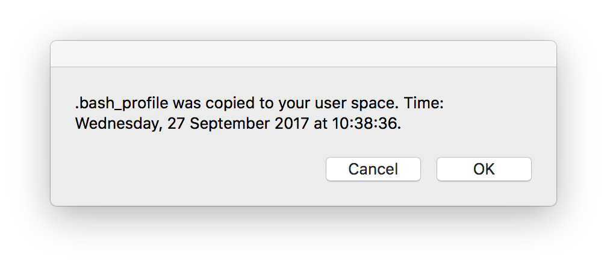{height="4cm"}
    :::

4.  Now open a new Terminalwindow (`cmd`-W closes the current window,
    `cmd`-N opens a new one). You should now see some additional lines
    of text in the terminal window that read:
    **`[ ran custom .bash_profile ]`** and
    **`Running FSL version: 5.0.4`**. If you see this, then the setting
    up of your machine is done. Every time you log in from now and start
    the **`Terminal`** application you'll be able to use the software
    straight away.

5.  Go to <file:///Applications/Utilities> and start the program called
    **`XQuartz`**. In theory, this should be launched automatically when
    you run the command in step
    [\[runFSL\]](#runFSL){reference-type="ref" reference="runFSL"}, but
    launching it by hand and enabling *Start at Login* speeds things up
    a bit.

    ::: {.center}
    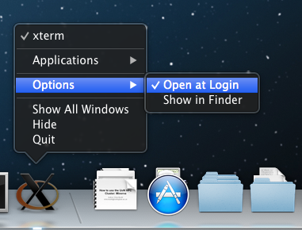{width="8cm"}
    :::

6.  Use the **`man`** command (manual) to find out about three basic
    commands. **`cp`** (copy), **`ls`** (list) and **`more`** (for
    looking at text files). Use the space-bar to go to the next page of
    the help documents and **`q`** to quit the help.

    ``` {caption="Finding help for commands"}
    man ls # things behind a "#" are comments
    man cp # this is the man-page for the Unix copy command
    man more 
    man cp 
    ```

7.  Run the **`fsl`** program from the command line and start fslview
    with **`fsl &`** (the last button on the window that pops up on your
    screen).[\[runFSL\]]{#runFSL label="runFSL"} Alternatively, you can
    run the viewer program directly from the command line:
    **`fslview &`**

    ::: {.center}
    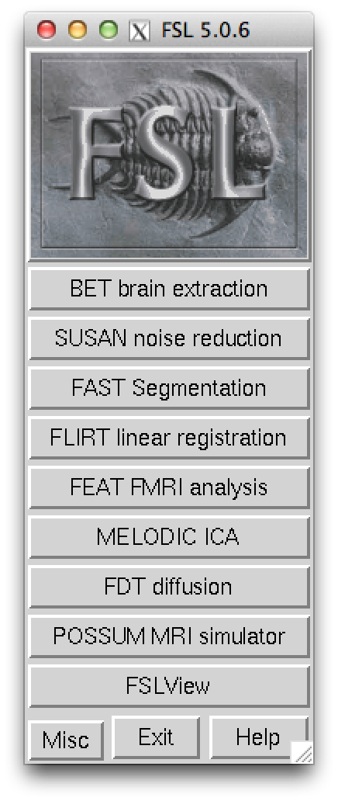{height="9cm"}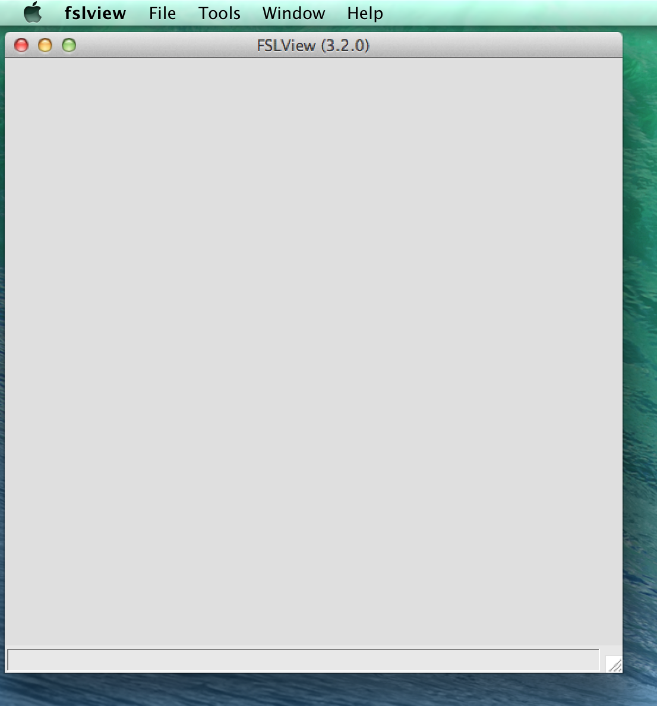{height="9cm"}
    :::

8.  File $\rightarrow$ Open Standard... and pick the file called
    `avg152T1.nii.gz` (or one of the other anatomy files in that folder,
    if you feel adventurous, noting down which one!)

9.  Familiarize yourself with the viewer program. Help $\rightarrow$
    Manual

# A simple statistical analysis using FSL / FEAT

## Overview

In today's workshop, you'll see how to perform a complete statistical
analysis as is done for real experiments. The data set we'll use is part
of the materials of an FSL course organized by the FMRIB Centre at
Oxford University. It was obtained in a language experiment, in which
the subject was presented with 3 different *events*.

1.  *Word-generation* (WG), for which the subject was presented with a
    noun (e.g. water) and had to *generate* an associated verb (e.g.
    boil, drink) and "think of it"

2.  *Word-shadowing* (WS), for which the subject had to "think of" the
    presented word (but not generate anything)

3.  *Null events* (NULL), during which the fixation cross just remained
    and nothing happened. This is an important control condition that
    allows people to estimate the *baseline* level of response.

Rather than having *blocks* that lasted 15-30s (as is often done in
fMRI), each of these trials lasts 6s and they happen in (pseudo-)random
order, e.g. something like WS...WG ...WG ...NULL ...WS ...NULL ...NULL
...

The aim of the analysis is to work out which areas of the brain were
more active during word generation and word shadowing than at rest, and
which areas were more active in one condition rather than the other.
We'll also look at a specific, pre-defined area (Broca's area in the
left hemisphere) to see what the level of activity was in each of the
conditions.

## Running the analysis

I suggest you work through the following in your groups and discuss to
make sure everyone in your group understands each step. To run the
analysis, start up **`Feat_gui`** in the Terminal.

1.  **You should already have a copy of the data set in your `fslData`
    directory**, so there should be no need to do this first step again.
    If not, copy the data set from the network drive to a folder in your
    home directory, make the new folder your *current working directory*
    by **`cd`**'ing into it and start the program window for the main
    analysis program.

        # check if the fslData folder exists!  
        # It shouldn't, as you've never done this before
        ls ~/fslData 

        # if not, copy the files
        cp -r /Volumes/practicals/ds1/msc/fslData  ~/

        # change directory to make it the "working directory"
        cd ~/fslData

        # and start FEAT. The & frees the Terminal up
        Feat_gui &

    ::: {.center}
    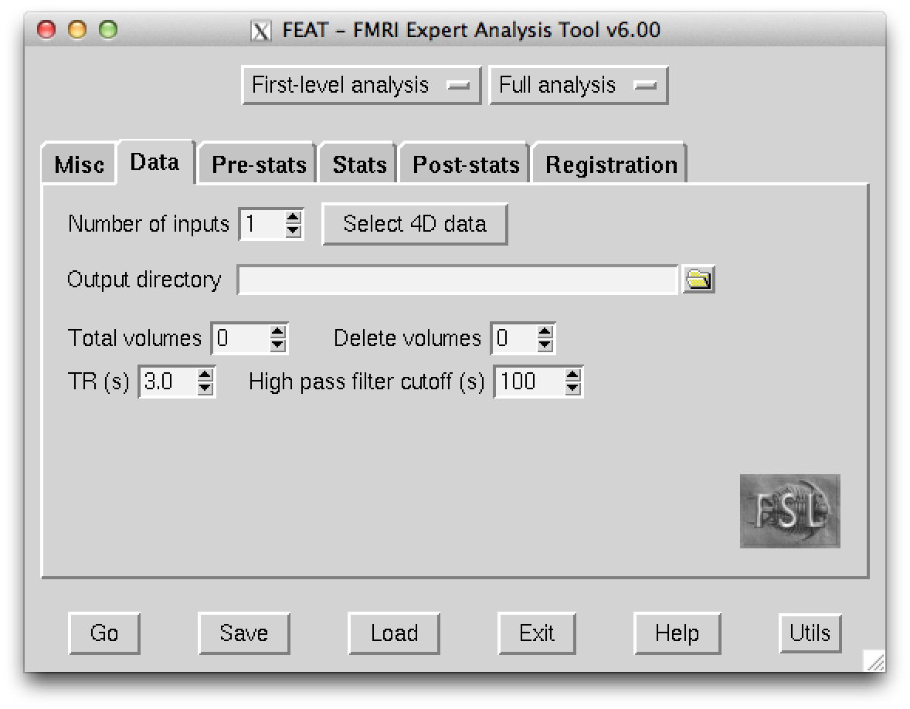{width="7.5cm"}
    :::

2.  The program opens up, automatically set to *First-level analysis*
    and *Full analysis*. There are several window tabs (\"Data\",
    \"Pre-stats\", ...) and we need to step through each of them, to
    change a small number of settings.

3.  In the **Data** tab: Click the **`Select 4D data`** button and
    select the **`fmri.nii.gz`** file by pressing the little folder icon
    in the pop-up window (note, that the file name will be different
    from what's shown in the screen shot here):

    ::: {.center}
    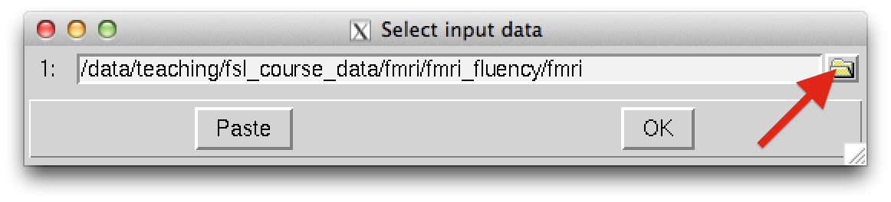{width="7.5cm"}
    :::

4.  You should now see the \"Total volumes\" field update to 106 and
    \"TR (s)\" to 4.2

5.  In the **Pre-stats** tab: nothing to change. The defaults should
    work fine.

6.  In the **Stats** tab: here we need to set up the *model*, i.e. the
    timing of the different events that happened in the experiment.
    Click the **`Full model setup`** button and do the following:

    -   \"Number of original EVs\" **2**. This creates two sub-tabs in
        the \"EVs\" part of the window.

    -   then for tab **1**: \"EV name\" **generation**, \"Basic shape\"
        **Custom (3 column format)** and select the
        **`word_generation.txt`** file, \"Convolution\" **Double-Gramma
        HRF**

    -   then for tab **2**: \"EV name\" **shadowing**, \"Basic shape\"
        **Custom (3 column format)** and select the
        **`word_shadowing.txt`** file, \"Convolution\" **Double-Gramma
        HRF**

        ::: {.center}
        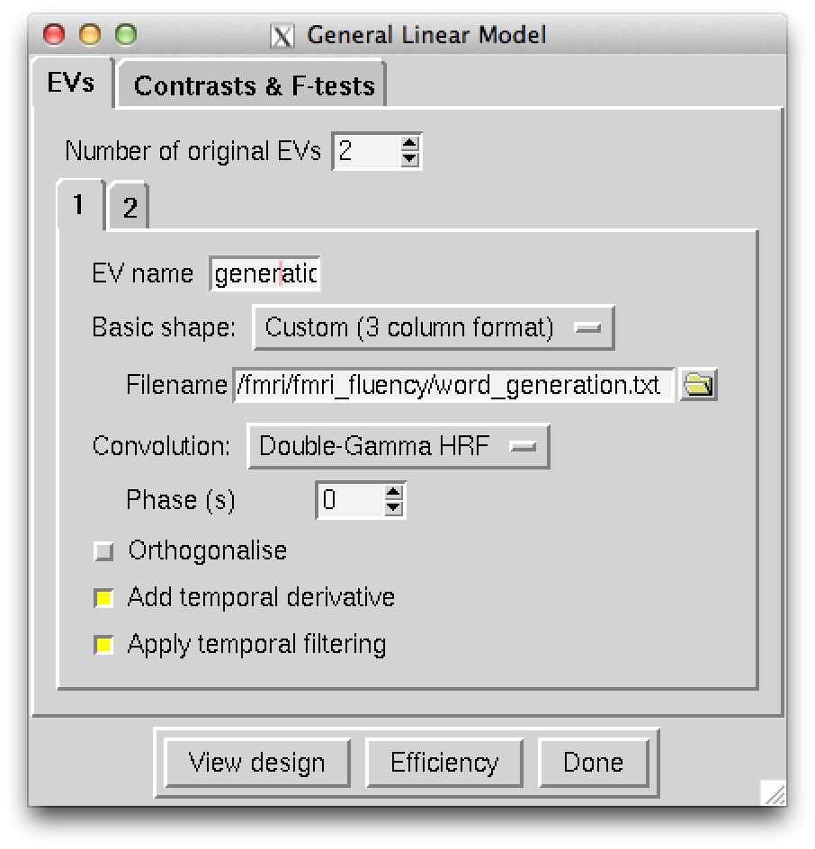{width="7.5cm"}
        :::

    -   In the \"Contrasts & F-tests\" tab you can then set up **5
        contrast** and **1 F-test**, entering text and clicking the
        up/down arrows until you have the following 5 contrasts...

        ::: {.center}
          --------------- ----------
          Generation       \[1 0\]
          Shadowing        \[0 1\]
          Mean             \[1 1\]
          Shadow \> Gen    \[-1 1\]
          Gen \> Shadow    \[1 -1\]
          --------------- ----------
        :::

        ::: {.center}
        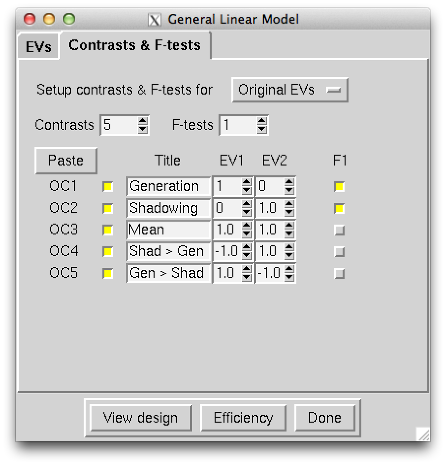{width="7.5cm"}
        :::

    -   If you know click the \"View Design\" button, you should see a
        window as follows (you may have noted that there are 4 columns,
        rather than 2. That's ok - the program has added two extra
        columns to deal with some slack in timing - this is a bit
        technical, but I am happy to explain if you are interested):

        ::: {.center}
        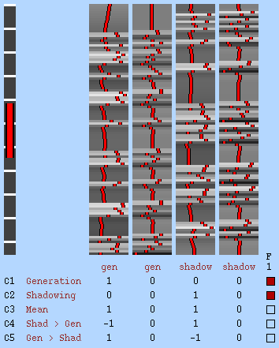{width="7.5cm"}
        :::

    -   Click \"Done\" and move on to the next tab.

7.  In the **Post-stats** tab: nothing to change. The defaults should
    work fine.

8.  In the \"Registration\" tab, we need to do one more thing. Click on
    \"Main structural image\", and after clicking the folder button, you
    can select the **`structural_brain.nii.gz`** image to be used as an
    intermediate step in registration. **Important:** switch from the
    \"BBR\" method in the pulldown menu to the \"7 DOF\" one.

9.  Now we are done setting everything up. If you now press the **`Go`**
    button, the analysis will start and a web browser should pop up and
    keep you posted on progress - how cool is this?

10. **What do all those results mean?** We'll go through this in some
    detail next time.

    The file [**`rendered_thresh_zfstat1.png`**]{style="color: red"} is
    inside the folder that was created during the analysis,
    **`fmri.feat`** by default. This image, note it's the one called
    [**`z`**]{.ul}**`fstat`**, shows areas that are more active during
    either word generation or shadowing, so when subjects are engaged in
    language processing.

    It should look something like the following:

    ::: {.center}
    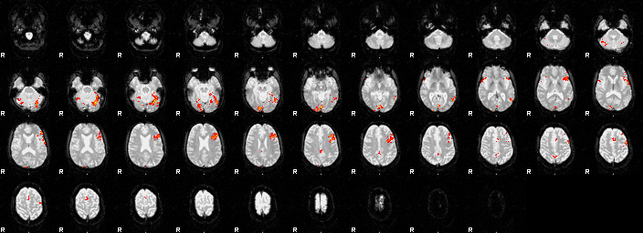{width="13cm"}
    :::

    ...and if we zoom in, we can see a nice hotspot right around where
    we think Broca's area is:

    ::: {.center}
    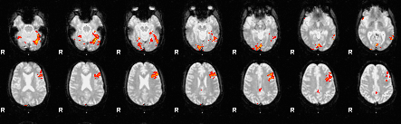{width="13cm"}
    :::

------------------------------------------------------------------------

# Questions

------------------------------------------------------------------------

# Ninja skills - Unix and FSL

1.  Make a directory called `workshopNotes` in your home directory using
    Unix commands in the terminal. Note down how you did it.

2.  The Mac operating system has a command called **`say`**. Check out
    what the following command call does

        say "This class rocks" 

3.  What other options for this command can you find with **`man say`**?
    Page all the way down to the EXAMPLES section of the man-page.

4.  Have a look at the *mask* (or *region of interest*) I have pre-made
    for you. It's an image that labels all the voxels where we think
    there is a higher than 50% probability of being in Broca's area in
    the left hemisphere (Brodmann areas 44 and 45, L).

    ::: {.small}
        fslview $FSLDIR/data/standard/MNI152_T1_2mm -l Greyscale Broca -l Red &
    :::

    If you want to understand how this command works and pops up both
    images in different colormaps, have a look at the help for the
    **`fslview`** program as follows:

        fslview --help

5.  You can *redirect* the output of the **`UNIX`** commands into a
    simple text file. The redirect operator (**`>`**) does exactly what
    you want. For example, to put some text into a new text file you can
    use:

        echo "This is so cool."
        # prints or "echo"s things in the Terminal

        echo "This is so cool." > newTextFile.txt
        # prints or "echo"s things into a new file 
        # (and also creates it if needed)

        ls newTextFile.txt

        # and use the following to look inside the new file
        cat newTextFile.txt

        echo "My login is $LOGNAME" >> newTextFile.txt
        # >> appends, the variable $LOGNAME contains your login!

6.  Automatically copy the output of the command to the *clipboard*
    (where you copy & paste from usually in, say, Microsoft Word:

        fslmeants -i fmri -c 42 42 26 | pbcopy
        # the | symbol represents a "pipe" and forwards
        # the output to another command (rather than a text file)

        #check out what pbpaste returns.
        pbpaste 

# Additional resources

Check out information on the GLM (General\[ized\] Linear Model and
various other statistical issues here):

-   <http://fsl.fmrib.ox.ac.uk/fslcourse/>

-   <http://fsl.fmrib.ox.ac.uk/fslcourse/lectures/feat1_part1.pdf>
