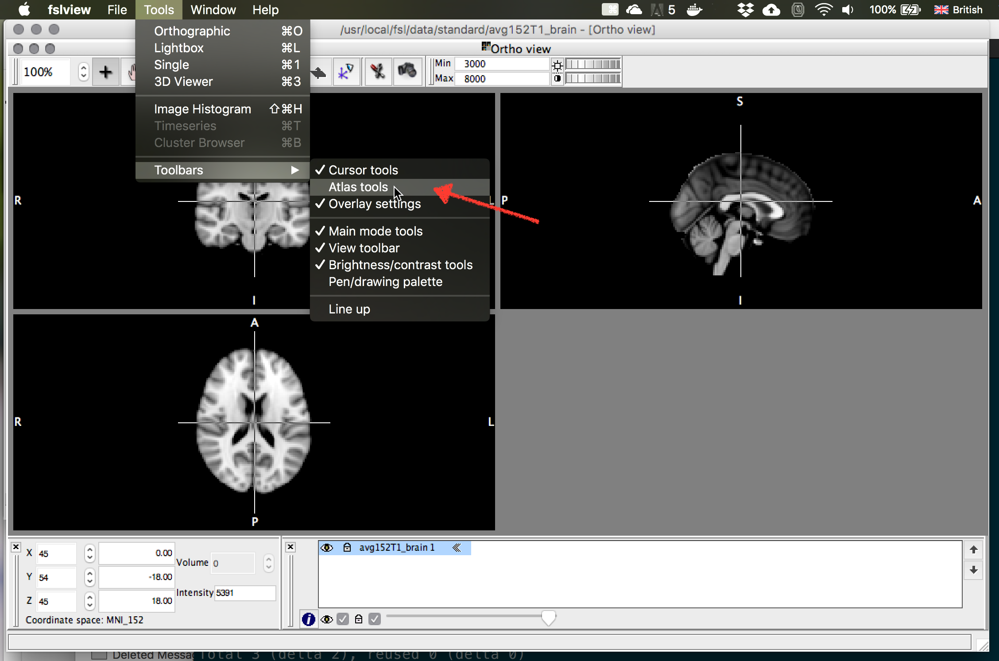
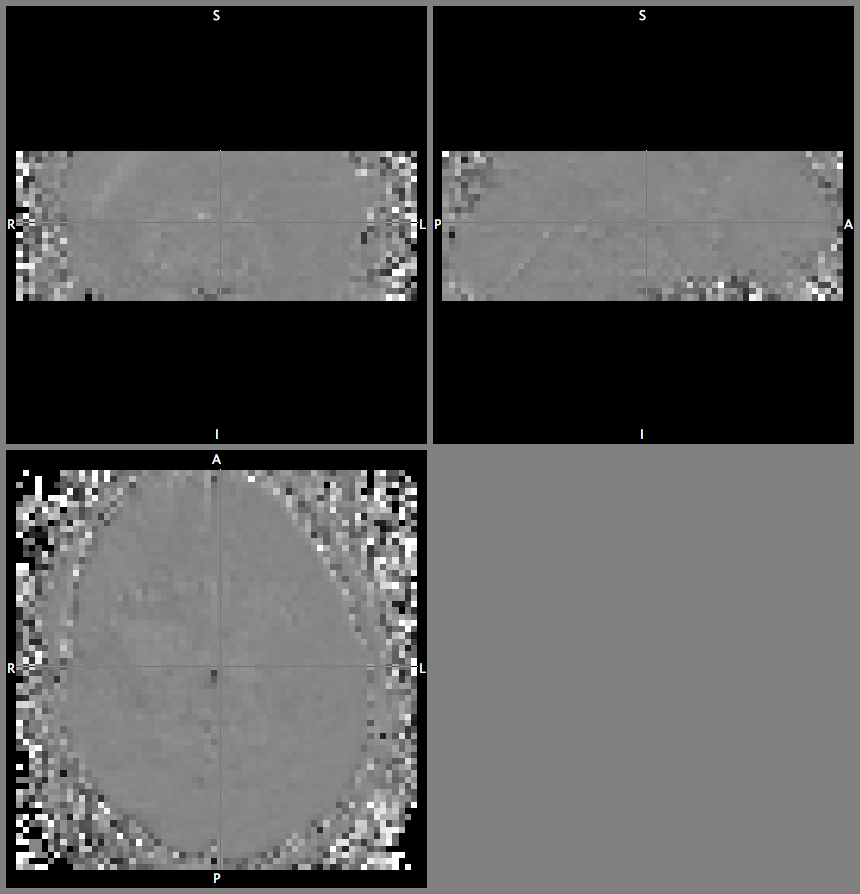

# Some ``fsl/bash`` tricks

## Aims

The aims of this page are:

- show you a couple of command line tricks for creating images / stats with exisiting ``fsl`` tools
- explain a bit more about the intermediate and summary results of a ``fsl/FEAT`` analysis so you can make use of them
- point you in the right direction for finding more help

You might find some of this helpful for completing the assignment - but also for future reference!

## Assumptions

To give you some concrete examples, I assume you are running ``Terminal`` and have access to the ``dafni`` dataset 1 (which should be stored in ``S001`` unless you made some deliberate choice to rename at some point).

If you are using a different dataset, adjust accordingly. Names *inside* ``feat`` directories are consistent (a nice design choice by the `fsl` team).

Raw data files are:

```bash
dafni_01_FSL_2_1.nii
dafni_01_FSL_3_1.nii
dafni_01_FSL_4_1.nii
dafni_01_FSL_5_1.nii		
dafni_01_FSL_6_1.nii		
dafni_01_FSL_7_1.nii
```

The folders produced by ``FEAT`` are these:

```bash
dafni_01_FSL_4_1.feat/
dafni_01_FSL_6_1.feat/
```

## Code snippets, ideas

1. [Opening the html report](#html_report)
2. [Turning anatomy file into animated gif](#anatomy_gif)
3. [Turning anatomy file 3-midsection view/PNG](#anatomy_midslice)
4. [Rendering stats images](#render_stats)
5. [Rendering stats images (highres)](#render_hires)
6. [Identifying clusters (from labels)](#cluster_id)
7. [Switch on atlas tools](#activate_atlas)
8. [FSL command line tools, bet, ...](#fsl_commandline)
9. [Get mean timecourse in ROI](#roi_mean)
10. [Motion correct two fMRI scans and "average" them](#motion_comp_av)

### Opening the html report, Finder <a name="html_report"></a>

Don't forget to use TAB-completing whenever you can!

```bash
cd ~/S001
cd dafni_01_FSL_4_1.feat

# pop up report in browser
open -a "Google Chrome" report.hml

# pop up current folder in Finder
open .
```

### Turning anatomy image into animated GIF  <a name="anatomy_gif"></a>

```bash
pwd
# make sure you are in dafni_01_FSL_4_1.feat

# turn anatomy image into animated GIF.
# leading to facebook and twitter happiness...
fslanimate dafni_01_FSL_3_1.nii inplane.gif

# pop up report in browser
open -a "Google Chrome" inplane.gif
```

### Turning anatomy image into mid-slice image (for report?) <a name="anatomy_midslice"></a>

```bash
pwd
# make sure you are in dafni_01_FSL_4_1.feat

# turn anatomy image into animated GIF.
# leading to facebook and twitter happiness...
slicer dafni_01_FSL_7_1.nii -a S001-midplanes.png

# open in preview
open S001-midplanes.png

# learn more about slicer
slicer   # without input args
```

### Rendering stats images <a name="render_stats"></a>

Lots of info / help on how to use a GUI tool called ``Renderstats_gui`` on [this FSL wiki page](https://fsl.fmrib.ox.ac.uk/fsl/fslwiki/Miscvis?highlight=%28%5CbCategoryOther%5Cb%29)

```bash
pwd
# make sure you are in dafni_01_FSL_4_1.feat
Renderstats_gui &
```


Then make 2 stats images overlay by increasing the counter to 2 and loading in the images you want to overlay. Here I have chosen to redner ``thresh_zstat3.hdr`` in red colors, and ``thresh_zstat6.hdr`` in blue-ish colors. Make sure start thresholding at a reasonable Z-value (2.3 is what would have been set in the options in your FEAT analysis). I called the output image ``three_versus_four`` but thats up to you to decide...

With this **new** combined image, you can now call ``slicer`` again to do a nice summary

```bash
slicer three_versus_four.img -a stats_test.png

# and look at it in Preview
open stats_test.png
```

NB! ``slicer`` has many other options - play around with them. These datasets also lend them to showing all axial slices in a montage... as there is a nice medial/lateral dissocation in the blobs.


### Rendering on high-resolution anatomies  <a name="render_hires"></a>

If you have registered your data into standard (or another high-resolution) space, you can also get ``FEAT`` to make nice, superimposed images with the following:

```bash
pwd
# make sure you are in dafni_01_FSL_4_1.feat

Renderhighres_gui &
```

Select the ``.feat`` directory you want to "convert" and click "Go" to let the conversion happen. This will create a subdirectory called ``hr`` which you can inspect - by default this tool also produces a .png image montage (although you can use the ``slicer`` command [see above] to get more funky).


### Which cluster is which? <a name="cluster_id"></a>

To visualise the cluster assignments that ``FEAT`` does, you can inspect

```bash
pwd
# make sure you are in dafni_01_FSL_4_1.feat

# load up fslview (with a EPI image as default bg)
fslview example_func &

# File -> Add... and choose e.g. cluster_mask_zstat4)
```


If you look at the superimposed image... you will see differently coloured regions corresponding to value (cluster) ``1``, ``2``, ...

There are also ways to further use this (logical) information - think of them as "masks" or "regions of interest" which are all stored together in one image. You could combine info about "where is the cluster index == 4" with "where in another statistical image are there significant responses".

>If you want to try this out... you can search documentation. Hint:
> ``fslmaths`` with options
>  ``-thr`` SOMENUMBER
>  ``-uthr`` SOME_other_NUMBER
>  ``-bin``
>  ``-mas``
> will allow you to do some of those things

These are interesting things to do - but the nitty-gritty may be beyond the scope of this class. Questions: don't hesitate to ping on moodle forum.

### Activate atlas tools <a name="activate_atlas"></a>

If you are looking at an image in **Standard space** (e.g. the MNI 152 average), in ``fslview`` you can activate the atlas tools to find out where you are, w.r.t. a probabilistic atlas. Check the help for more details.



### Using ``fslmaths``, ``bet2`` and other tools in command line <a name="fsl_commandline"></a>

Have a look at the example ``bash`` script called [example_fsl_analysis.sh](example_fsl_analysis.sh) to see how you could use low-level command line tools extract a time course (``fslmeants``) ror do skull-stripping (``bet2``) or simple maths with the images (e.g. for calculating percent signal change).

If you copy the script into the folder that contains your data (so, inside `S001``), then you can run the following command in the terminal - or better copy and paste individual lines one by one from the text editor and run them in sequence

```bash
sh example_fsl_analysis.sh

# or better
open example_fsl_analysis.sh
# copy and paste into terminal and use ls and fslview to see what's happening
```




and after some cleaning up and masking - the final image looks different


### Getting mean time series across an ROI <a name="roi_mean"></a>

There is a short video showing you how you can use (and create) a region of interest (aka mask) with the command ``fslmeants``. Use this in combination with the other tricks to get data at the command line. The other option is to load raw data into Matlab and manipulate there.

- [link to youtube clip](http://www.youtube.com/watch?v=wgNhsE1yM_E)
- I have also made the command history of what I typed into the prompt [available in this file here](command_history). Have a look at this, too.

### Averaging to fMRI scans with same timing (after motioncomp) <a name="motion_comp_av"></a>

Assuming you have two fMRI scans that are exact repeats of the same experiment, say a visual experiment with same stimulus order... one thing you might want to do is to simple average them: take an average of the first time point in both scans, then the second time point, etc. This is a quick and dirty way of combining data - maybe running statistical analysis on each file separately and then combining those would be better... but it's still useful to have this trick up your sleave!

Let's say you have `scan1.nii` and `scan2.nii`

Idea:

1. take the first time point of `scan1` and use this as a reference for motion compensation
2. motion comp both scans (using that reference)
3. use image maths to combine the timeseries data into one average

```bash
# 1 - use fslroi to slice of 1 timepoint starting at 0
#
fslroi scan1 ref 0 1

# 2 - use mcflirt command line using this new 'ref' file
mcflirt -in scan1 -out scan1_mcf -r ref.nii
mcflirt -in scan2 -out scan2_mcf -r ref.nii

# 3 - now use fslmatnhs to do voxel (and timepointswise addition and divide by 2)
fslmaths scan1_mcf.nii -add scan2_mcf.nii -div 2 scanAv

# 4 - inspect result:
fsleyes scanAv.nii
```


### Other ideas

- command line stats using ``fslstats``
- simple image manipulation with ``fslmaths``

Ping me, if you have questions or suggestions.
