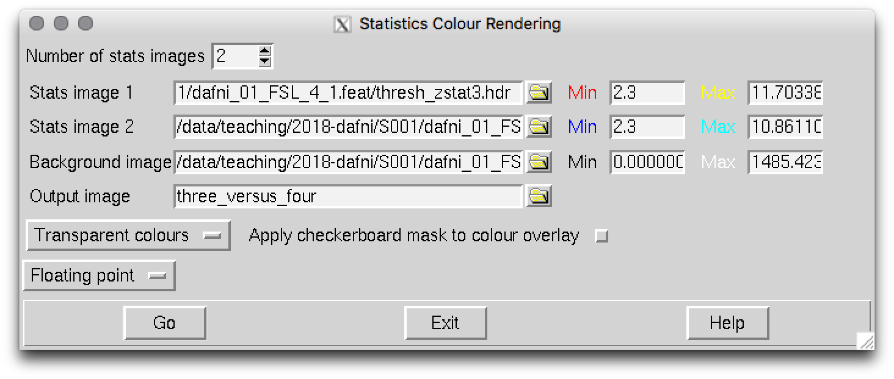
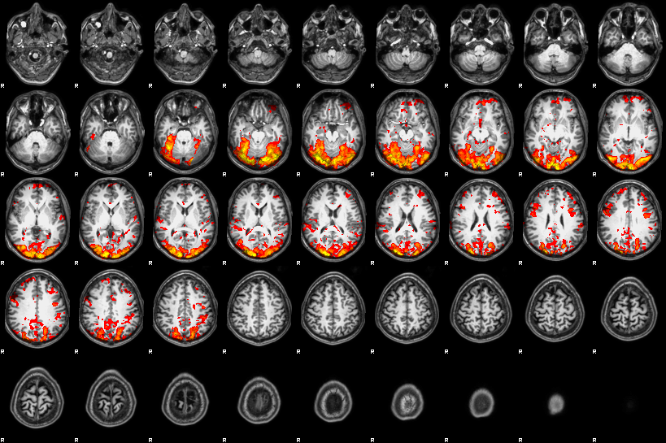
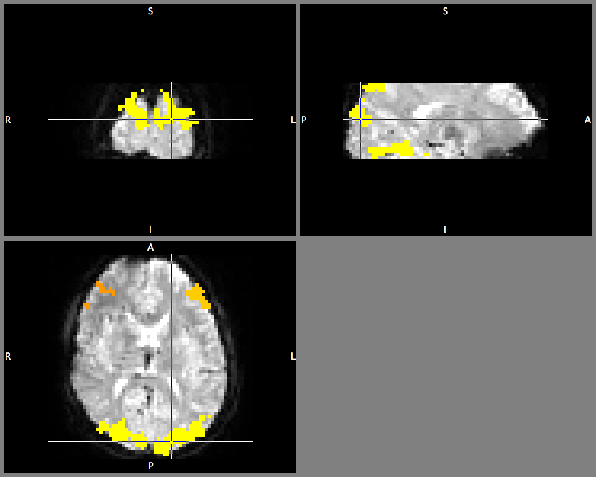

# Some ``fsl/bash`` tricks

## Aims

The aims of this page are:

  - show you a couple of command line tricks for creating images / stats with exisiting ``fsl`` tools
  - explain a bit more about the intermediate and summary results of a ``fsl/FEAT`` analysis so you can make use of them
  - point you in the right direction for finding more help

You might find some of this helpful for completing the assignment - but also for future reference!

## Assumptions

To give you some concrete examples, I assume you are running ``Terminal`` and have access to the ``dafni`` dataset 1 (which should be stored in ``S001`` unless you made some deliberate choice to rename at some point).

Raw data files are:

```bash
dafni_01_FSL_2_1.nii
dafni_01_FSL_3_1.nii
dafni_01_FSL_4_1.nii
dafni_01_FSL_5_1.nii		
dafni_01_FSL_6_1.nii		
dafni_01_FSL_7_1.nii
```

The folders produced by ``FEAT`` are these:

```bash
dafni_01_FSL_4_1.feat/
dafni_01_FSL_6_1.feat/
```

## Code snippets, ideas

### Opening the html report, Finder

Don't forget to use TAB-completing whenever you can!

```bash
cd ~/S001
cd dafni_01_FSL_4_1.feat

# pop up report in browser
open -a "Google Chrome" report.hml

# pop up current folder in Finder
open .
```

### Turning anatomy image into animated GIF

```bash
pwd
# make sure you are in dafni_01_FSL_4_1.feat

# turn anatomy image into animated GIF.
# leading to facebook and twitter happiness...
fslanimate dafni_01_FSL_3_1.nii inplane.gif

# pop up report in browser
open -a "Google Chrome" inplane.gif
```

### Turning anatomy image into mid-slice image (for report?)

```bash
pwd
# make sure you are in dafni_01_FSL_4_1.feat

# turn anatomy image into animated GIF.
# leading to facebook and twitter happiness...
slicer dafni_01_FSL_7_1.nii -a S001-midplanes.png

# open in preview
open S001-midplanes.png

# learn more about slicer
slicer   # without input args
```

### Rendering stats images

Lots of info / help on how to use a GUI tool called ``Renderstats_gui`` on [this FSL wiki page](https://fsl.fmrib.ox.ac.uk/fsl/fslwiki/Miscvis?highlight=%28%5CbCategoryOther%5Cb%29)

```bash
pwd
# make sure you are in dafni_01_FSL_4_1.feat
Renderstats_gui &
```



Then make 2 stats images overlay by increasing the counter to 2 and loading in the images you want to overlay. Here I have chosen to redner ``thresh_zstat3.hdr`` in red colors, and ``thresh_zstat6.hdr`` in blue-ish colors. Make sure start thresholding at a reasonable Z-value (2.3 is what would have been set in the options in your FEAT analysis). I called the output image ``three_versus_four`` but thats up to you to decide...

With this **new** combined image, you can now call ``slicer`` again to do a nice summary

```bash
slicer three_versus_four.img -a stats_test.png

# and look at it in Preview
open stats_test.png
```

NB! ``slicer`` has many other options - play around with them. These datasets also lend them to showing all axial slices in a montage... as there is a nice medial/lateral dissocation in the blobs.


### Rendering on high-resolution anatomies

If you have registered your data into standard (or another high-resolution) space, you can also get ``FEAT`` to make nice, superimposed images with the following:

```bash
pwd
# make sure you are in dafni_01_FSL_4_1.feat

Renderhighres_gui &
```

Select the ``.feat`` directory you want to "convert" and click "Go" to let the conversion happen. This will create a subdirectory called ``hr`` which you can inspect - by default this tool also produces a .png image montage (although you can use the ``slicer`` command [see above] to get more funky).




### Which cluster is which?

To visualise the cluster assignments that ``FEAT`` does, you can inspect

```bash
pwd
# make sure you are in dafni_01_FSL_4_1.feat

# load up fslview (with a EPI image as default bg)
fslview example_func &

# File -> Add... and choose e.g. cluster_mask_zstat4)
```



If you look at the superimposed image... you will see differently coloured regions corresponding to value (cluster) ``1``, ``2``, ...

There are also ways to further use this (logical) information - think of them as "masks" or "regions of interest" which are all stored together in one image. You could combine info about "where is the cluster index == 4" with "where in another statistical image are there significant responses".

>If you want to try this out... you can search documentation. Hint:
> ``fslmaths`` with options
> ``-thr`` SOMENUMBER
> ``-uthr`` SOME_other_NUMBER
> ``-bin``   
> ``-mas`` 
> will allow you to do some of those things

These are interesting things to do - but the nitty-gritty may be beyond the scope of this class. Questions: don't hesitate to ping on moodle forum.


### Other ideas

- command line stats using ``fslstats``
- simple image manipulation with ``fslmaths``

Ping me, if you have questions or suggestions.
