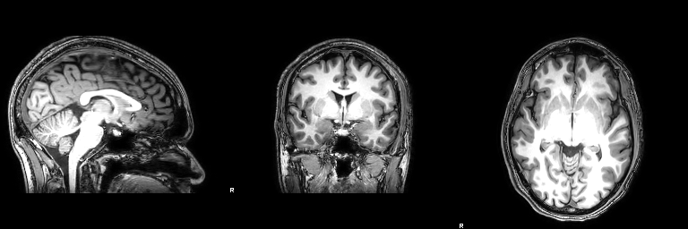
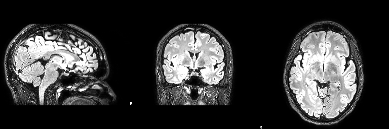
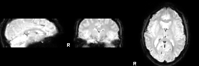

# Getting Data

## What's the plan?

| Unit     | Topic                                            |
|:---------|:-------------------------------------------------|
| 2 :star: | Data acquisition (**scanning on 3T**)            |


## Data acquisition in the scanner

fMRI data ~~will be~~ was acquired in ~30min sessions (in small groups) on one of our 3T scanners. Have a look at
[the webpage for the 3T scanners on campus](https://www.nottingham.ac.uk/research/groups/spmic/facilities/facilities.aspx) to learn a bit more about the machines.  Up until last year we ran our experiments on the 3t Achieva, but the SPMIC has now decommisioned that machine to make space for the [new, national 11.7T facility](https://www.nottingham.ac.uk/research/groups/spmic/research/national-facility-for-ultra-high-field-11.7t-human-mri-scanning/index.aspx) which is currently being planned in detail.

Two important sets of things to consider:

- what are the parameters / settings on the MRI scanner?
- what is the subject doing in the scanner (stimuli & task)?

## Scanner - Protocol

The protocol will be pretty standard for a cognitive neuroscience scanning sessions. The plan for the time in the scanner is as follows

1. Quick survey scan to allow "planning" on console **(< 10s)**
2. A test EPI to make sure that the slice positioning for the fMRI experiment is ok.
3. fMRI experiment (block): gradient-echo EPI, TR 1.5s **(~4min)**
4. T1w-MPRAGE: to illustrate detailed (1mm isotropic) anatomy **(~5min)**
5. T2w-FLAIR: (1mm isotropic)

## Stimulus code 

+ stimulus code: inspect ``FFAlocaliser``  for lots of details. 
+ **timing: block design** 12s images (faces, objects), 12s rest: a 24s cycle. 10 repeats per scan - 240s or 160 dynamics (@ 1.5s). Stimuli were images from face and object image database (details below).

The code is written in ``matlab/mgl`` using the ``task`` library that comes with ``mgl``. Written by Alex Beckett and DS based on a version of a working code from Justin Gardner :smile:

There are a couple of short youtube videos explaining a version of <a href="https://youtu.be/wcA_h-rrVeM" target="_blank">the FFA localiser</a> and the <a href="https://youtu.be/exqNc7q8zSs" target="_blank">fixation dimming task</a> to control attention, which would be used in a real experiment. This should give you  a sense of what the subject is doing inside the scanner.

The experiment runs as a simple block design in the following order:

>[rest, faces] , [rest, objects] - ...

The length of each ``[stimulus, rest]`` cycle is determined by the ``cycleLength`` (in TRs).

To run, make sure the ``stimulusCode`` folder is on the path and then simply run the following command. the ``Escape`` key can be used to stop the experiment at any point:

```matlab
FFAlocaliser % quick test to see what's going on
```

To run at the MR centre, we also want to specify TR, not to run in a small window, etc. So probably worth setting a few parameters in the call like this:

```matlab
FFAlocaliser('TR=1.5', 'debug=0', 'numBlocks=10', 'cycleLength=12')
```

## Scanner - actual numbers from the day (2024/25)

2025-02-06, Denis Schluppeck

3 volunteers (``sub-01`` .. ``sub-03``), scanned on the 3T Philips Ingenia scanner at the SPMIC UP site. Scanner operator: AC. Start times 930h, 1015h, 1100h.

(Data available via `moodle` link to a zip file on OneDrive). 

For each person we obtained several scans. See `json` sidecar copied along for some details.

- T1w MPRAGE (1mm isotropic)
- T2w FLAIR  (1mm isotropic)
- two repeats of an fMRI experiment (`FFAlocaliser.m`); 
2.167mm inplane, 2.5mm slice thickness (so not quite isotropic), TR/TE 1500ms/30ms







## fMRI experiment and timing

- the original scan was 160 timepoints long, some "dummy" volumes were not saved on the scanner to allow for steady state. 
- timing of the experiment is (rest-Faces-rest-Obj)*5)

```
12s OFF (gray).   |
12s ON (faces).   |
                  |
12s OFF (gray).   |
12s ON (objects). |

... then each repeated for a total of 10 stimulus-rest blocks (5 faces, 5 objects)
```


## Previous scanning sessions

- [2023-24 cohort](./2023-24-scanning.md)

- [2022-23 cohort](./2022-23-scanning.md)

- [2019-20 cohort](./2019-20-scanning.md)

- [2018-19 cohort](./2018-19-scanning.md)

- [2017-18 cohort](./2017-18-scanning.md)


### Materials for stimuli:


We'll run a "Faces versus objects / scenes localiser, as this works well and is a very robust experiment.

- Faces download:
https://wiki.cnbc.cmu.edu/images/multiracial.zip

>Stimulus images courtesy of Michael J. Tarr, Center for the Neural Basis of Cognition and Department of Psychology, Carnegie Mellon University, https://www.tarrlab.org/. Funding provided by NSF award 0339122.

- Objects download:
https://bradylab.ucsd.edu/stimuli/Exemplar.zip

>Object stimuli from: Brady, T. F., Konkle, T., Alvarez, G. A. and Oliva, A. (2008). Visual long-term memory has a massive storage capacity for object details. Proceedings of the National Academy of Sciences, USA, 105 (38), 14325-14329.

- Scenes download: https://timbrady.org/stimuli/Scenes.zip

>Scene stimuli from: Konkle, T.*, Brady, T. F.*, Alvarez, G.A. and Oliva, A. (2010). Scene memory is more detailed than you think: the role of categories in visual long-term memory. Psychological Science, 21(11), 1551-1556.
