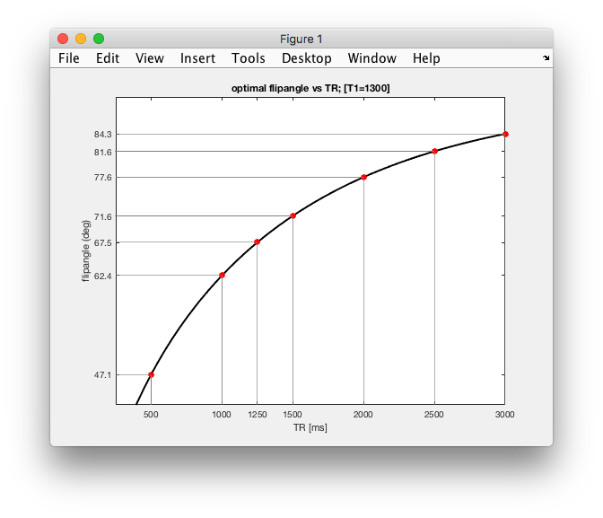

# Getting Data

## Data acquisition in the scanner

fMRI data will be acquired in 45min sessions (in small groups) on one of our 3T scanners. Have a look at
[the webpage for the 3T Philips Achieva](https://www.nottingham.ac.uk/research/groups/spmic/facilities/3-tesla-philips-achieva-mri-scanner.aspx) to learn a bit more about the machine we will be using.

Two important sets of things to consider:

- what are the parameters / settings on the MRI scanner?
- what is the subject doing in the scanner (stimuli & task)?

## Scanner - Protocol

The protocol will be pretty standard for a cognitive neuroscience scanning sessions. The plan for the time in the scanner is as follows

1. Quick survey scan to allow "planning" on console **(< 10s)**
2. field map: to show that B0 can be measured **(< 1min)**
3. "inplane anatomy" - anatomical scan with planned slice prescription / coverage **(~2min)**
4. fMRI experiment (block): gradient-echo EPI, TR 2s, TE 40ms, FA: 78º **(1x or 2x ~4min)**
5. fMRI experiment (event-related): same scanning parameters, **(1x or 2x ~4min)**
6. T1w-MPRAGE: to illustrate detailed (1mm isotropic) anatomy **(~5min)**
5. [additional, if time permits] EPI data (test): 5 echoes at different TEs to illustrate T2* decay

You can have a look at the Matlab function ``flipAnglePlots()`` to remind yourself about why we picked the particular flip angle.



## Stimulus code

In ``matlab/mgl`` using the ``task`` library that comes with ``mgl``. Written by Alex Beckett and DS based on a version of a working code from Justin Gardner :smile:

There are a couple of short youtube videos explaining <a href="https://youtu.be/wcA_h-rrVeM" target="_blank">the FFA localiser</a> and the <a href="https://youtu.be/exqNc7q8zSs" target="_blank">fixation dimming task</a> to control attention. This should give you  a sense of what the subject is doing inside the scanner.

The experiment runs as a simple block design in the following order:

>[faces, rest] , [objects, rest] - ...

The length of each ``[stimulus, rest]`` cycle is determined by the ``cycleLength`` (in TRs).

To run, make sure the ``stimulusCode`` folder is on the path and then simply run the following command. the ``Escape`` key can be used to stop the experiment at any point:

```Matlab
FFAlocaliser % quick test to see what's going on
```

To run at the MR centre, we also want to specify TR, not to run in a small window, etc. So probably worth setting a few parameters in the call like this:

```Matlab
FFAlocaliser('TR=1.5', 'debug=0', 'numBlocks=10', 'cycleLength=12')
```

### Notes

- [x] working code with face and object images
- [x] parameters to set cycle length, TR, number of block
- [x] youtube clip explaining the fixation task and experiment
- [ ] write out text file in correct format for ``fsl/feat`` analysis.
- [ ] test with actual scanning parameters

### Materials for stimuli:

We will provide the stimulus code (written in Matlab / MGL) in line with what happened in - [Learning Matlab / C84NIM](https://github.com/schluppeck/learningMatlab) - a pre-requisite for this course.

We'll run a "Faces versus houses / scenes localiser, as this works well and is a very robust experiment.

- Faces download:
https://wiki.cnbc.cmu.edu/images/multiracial.zip

>Stimulus images courtesy of Michael J. Tarr, Center for the Neural Basis of Cognition and Department of Psychology, Carnegie Mellon University, https://www.tarrlab.org/. Funding provided by NSF award 0339122.

- Objects download:
https://bradylab.ucsd.edu/stimuli/Exemplar.zip

>Object stimuli from: Brady, T. F., Konkle, T., Alvarez, G. A. and Oliva, A. (2008). Visual long-term memory has a massive storage capacity for object details. Proceedings of the National Academy of Sciences, USA, 105 (38), 14325-14329.

- Scenes download: https://timbrady.org/stimuli/Scenes.zip

>Scene stimuli from: Konkle, T.*, Brady, T. F.*, Alvarez, G.A. and Oliva, A. (2010). Scene memory is more detailed than you think: the role of categories in visual long-term memory. Psychological Science, 21(11), 1551-1556.
