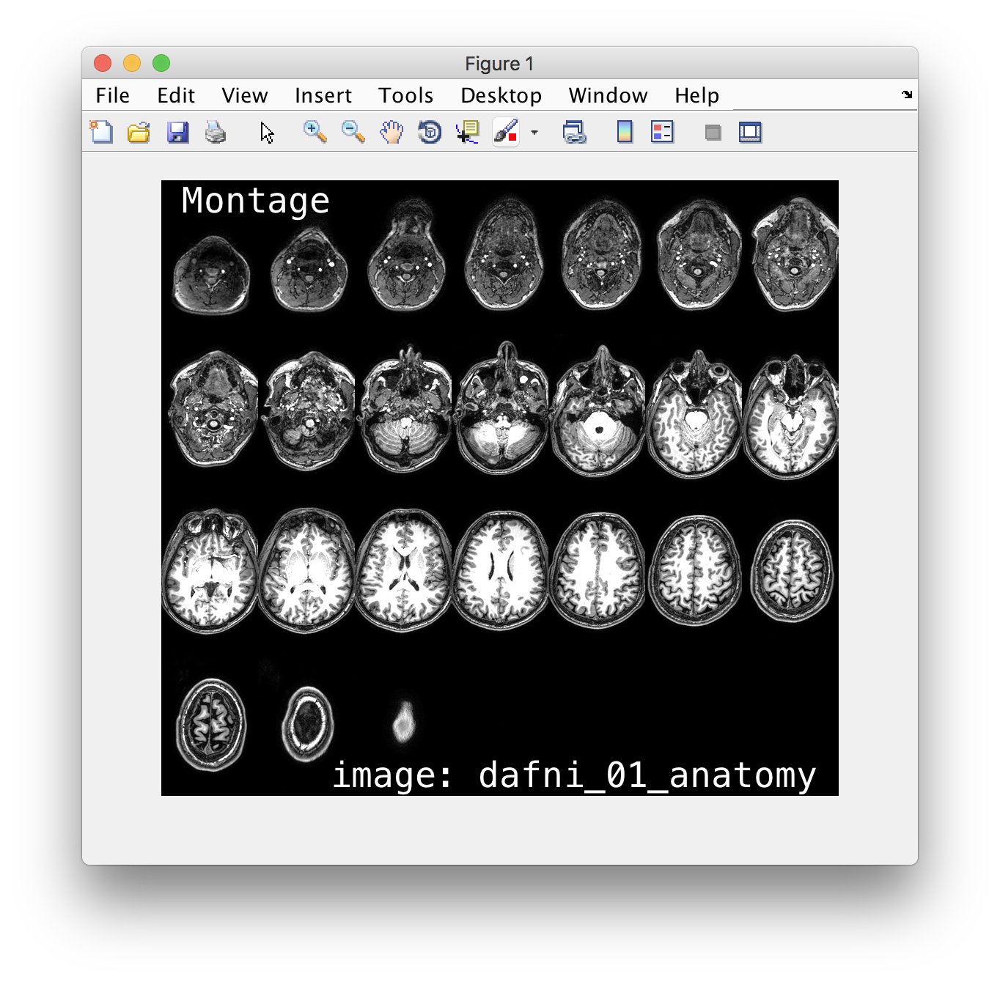
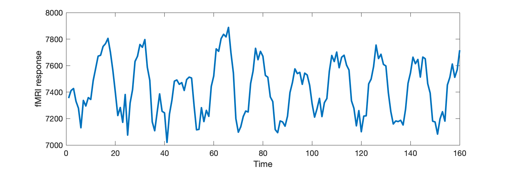
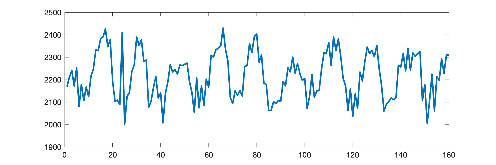

# Brain images + timecourses in Matlab

The aims of this lesson are:

  - refresh your memory about ``matlab``
  - see how to load ``nifti`` images (pre-2017b we need a toolbox, [now support is native](https://uk.mathworks.com/help/images/ref/niftiread.html)). See the first exercise below.

## Matlab, two ways...

### `makeMontage()`

For the first part of the session, I will do a coding walk-through with some narrated advice on problem solving, etc. In the second part of the session, you will then apply the ideas from the first part of make your own function for extracting timecourses from data.

  - we build a simple ``makeMontage()`` function for displaying 3d imaging data. **Plan out / design / write** ``makeMontage()``
  - thinking about putting your code under version control!
  


If you want, you can also have a more detailed look at the files and exercises in the [matlab_images folder](./matlab_images/Readme.md).

### `getTimecourse()`

In the second part of the session, we want you to make use of the ideas we introduced in the first part to:

- think about, draft, and write a function called `returnTimecourse()`
- it should take 4 input arguments `data`, `xcoord`, `ycoord` and `zcoord` (the coordinates should be in the format that `fsl` uses... in particular, start counting at 0, not 1 like matlab...!!)
- your function help / documentation should explain this behaviour to make sure your users don't get confused with it.
- and should return 1 ouput (call it `tcourse` inside the function)

```matlab
%  tcourse = returnTimecourse(data, xcoord, ycoord, zcoord);
% so you can use it with 
cd('fmri.feat') % go into the folder
data = niftiread('filtered_func_data.nii.gz');

% use it like this...
t = returnTimecourse(data, 30, 5, 2);
plot(t, 'linewidth',2)
xlabel('Time'); 
ylabel('fMRI response')
``` 



## if you get the following...

- then you haven't done quite the right thing.
- think about your indexing... what do you need to do to make sure 0-indexing (in `fsl`) gets translated into `1-indexing` in matlab use...



### `plot()` throws errors

- if you get weird errors from `plot()` then check whether you are doing the right thing to get a 1-d vector for plotting (maybe check with `size()`?!)


## if you don't have the `feat` folder

You can try to download [my version from this link](https://uniofnottm-my.sharepoint.com/:u:/g/personal/denis_schluppeck_nottingham_ac_uk/EdBs0igKBxdJsf3EEGfRtLQBIOP-PMBGmR9q79K-NzhUPQ?e=5FMC2c)
 [requires UoN login]

## Follow-up, solutions

- have a look at my solution of [makeMontage.m](./matlab_images/makeMontage.m) -- this is not exactly the file I worked with in class, but follows exactly the same logic.

- for `returnTimecourse()` there is a way you could handle multiple voxels in one go for indexing. The ideas you have to work with are:

- idea 1: only partially reshape the 4d data. Eg an array that is 64x64x24x160 can be reshaped into a 2d array where the first dimensions is all of space, and the second dimensions is all of time. That's like turning the 3d image at each time point into one of the data "snakes".
- 
```matlab
% load 4d data
data = niftiread('filtered_func_data.nii.gz');
% reshape ...
sz = size(data);
sz_space = sz(1)*sz(2)*sz(3)
sz_time = sz(4) 
data_snake = reshape(data,[sz_space sz_time]);
size(data_snake)
```

- idea 2: turn the 3d voxel locations indices (sub) to linear indices (ind) using the matlab function `sub2ind()`

- you will need the `sz_space` to know how to turn e.g. a list of `x`, `y`, `z` values into the linear indices...

```matlab
x = [30,31,32]; 
y = [5,5,5]; 
z = [2,2,2];
t = [1, 1, 1];
linear_idx = sub2ind(size(data),x,y,z,t);

% then
tcourses = data_snake(linear_idx,:);
% make sure they are columns
tcourses = tcourses';

figure()
plot(tcourses);

```