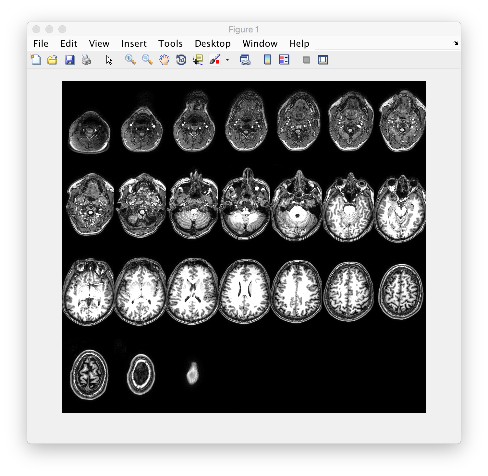
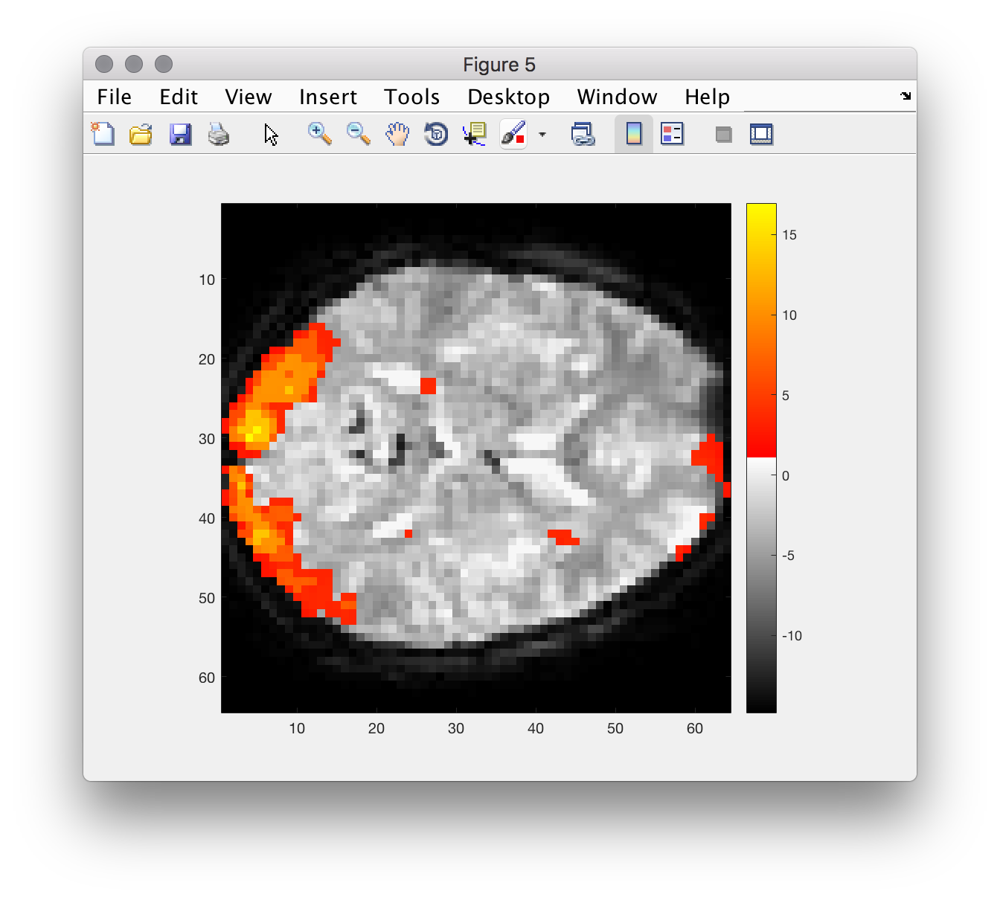
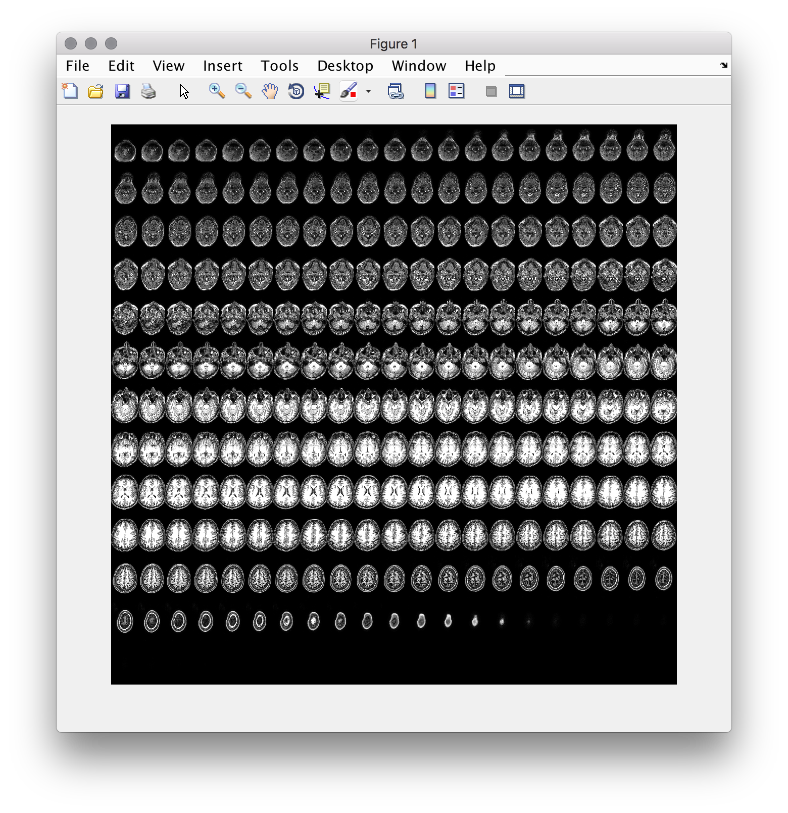

# Brain images in Matlab

The aims of this lesson are:

  - refresh your memory about ``matlab``
  - see how to load ``nifti`` images (pre-2017b we needed a toolbox, [now support is native](https://uk.mathworks.com/help/images/ref/niftiread.html)) and we can use the function ``niftiread()`` et al. See the first exercise below.
  - we will write a function for displaying 3d imaging data in a nice *montage* format. **Aim:** design, plan out and write the function ``makeMontage()``
  - thinking about putting your code under version control!

Matlab has powerful functions / toolboxes to make working with images and multi-dimensional arrays quite straightforward and I hope you will dig around the documentation to find out some things beyond what's covered here.

## Reading images into ``matlab``

### check version of matlab

The following check is not really necessary in the Psychology computer labs, but if you want to check on other lab machines, at another uni (or on your laptop)

```matlab
ver % should be R2017b or higher
which niftiread % should return a path
```

### now load and display image:

```matlab
% cd to a folder with a nifti file in it (like the one from last time):
cd ~/dafniData/
% try out  - make sure you have ; at end of line
data = niftiread('mprage.nii');

% then manipulate in matlab
```

Good commands to play around with are ``image``, ``imagesc``, ... You should also look back the ``returnSlice()``, the function we wrote for the Matlab course earlier in the year.

```Matlab
figure
imagesc(returnSlice(data, 12, 1))
axis('image')
colormap(gray)
```

## Background: specification for ``makeMontage()`` function

The user starts calls the function from the command line with a filename and a number that specifies how many images / tiles to display in the montage. E.g.

```matlab
makeMontage('dafni_01_FSL_7_1.nii', 25)
```

results in



## In small groups

- each person: spend 5 minutes or so looking through the documentation for the image processing toolbox ``doc images`` +/- googling and looking on stackoverflow
- regroup and write down any questions / ideas / suggestions you have for how you might go about this
- discuss and whittle down your ideas to a list of comments that will make the framework for your function:

```matlab
%% 0. function signature (first line of m-file)
%     plus H1 line and comments

%% 1. load in data (and deal with errors)

%% 2. prepare data for visualisation step

%% 3. ...
```

- are you stuck on anything? If you can put what you want to achieve into words (but are stuck on the Matlab / programming ) - the TA and I can help translate concepts into code...

## Helpful commands / concepts

The following information should help tackle the problem:

- Matlab provides a rich set of visualisation functions + helpers. Make sure you don't re-invent the wheel
- Look at examples / check out options that can modify the behaviour of existing functions.
- you can **re-arrange** the order of dimensions in an array. Check out [this explanation on permuting dimensions](permuting.md) -- nd I will also explain this in a walk through.
- see also ``imagesc``, ``min/max`` (or ``prctile``), ``colorbar``, ``doc images``

### Version control

Now that you have figured out the logic of what needs to happen. You can start adding files (make a copy!) to your **github repository** and adding/committing the changes. Try to

- add only code (not data)
- make your code self-contained to that folder (no dependencies to files in other locations...
- make "atomic" commits (small additions at a time not many changes in one go)
- add useful commit messages
- after you have ``commit``ed some changes, also ``git push`` to github.com

## Bonus, making montages of rendered FSL images  

The images produced by FSL in our analysis are also candidates for displaying in matlab figures (for your report?). However, displaying them with the correct colors using ``makeMontage()`` is not trivial... however simple slices are doable!

To make things a bit easier, I provide

```Matlab
% load a special colormap
load('renderMap.txt') % I got this from FSL and made it Matlab friendly
% load stats image
renderedImage = niftiread('rendered_thresh_zstat1.nii');

% display
figure
imagesc(returnSlice(renderedImage, 12, 3))
axis('image')
colormap(renderMap)
colorbar
% can you see what trick they used here??
```



## Notes (overall)

- one way to solve the problem makes use of a function that ships with the matlab image processing toolbox. To use it, you'll have to manipulate your data using ``permute``, ``reshape`` and similar functions. If you get images as follows, you are nearly there... don't hesitate to ask for help!



### [pre-2017b] paths, etc

Make sure that the ``mrTools`` toolbox is on the path:

```Matlab
addpath(genpath('/Volumes/practicals/ds1/mrTools'))

which mlrImageReadNifti
% should return a valid path!
```

### now load and display image:

```matlab
% try out  - make sure you have ; at end of line
[data hdr] = mlrImageReadNifti('path_to_3d_testfile.nii');

% then manipulate in matlab
```
