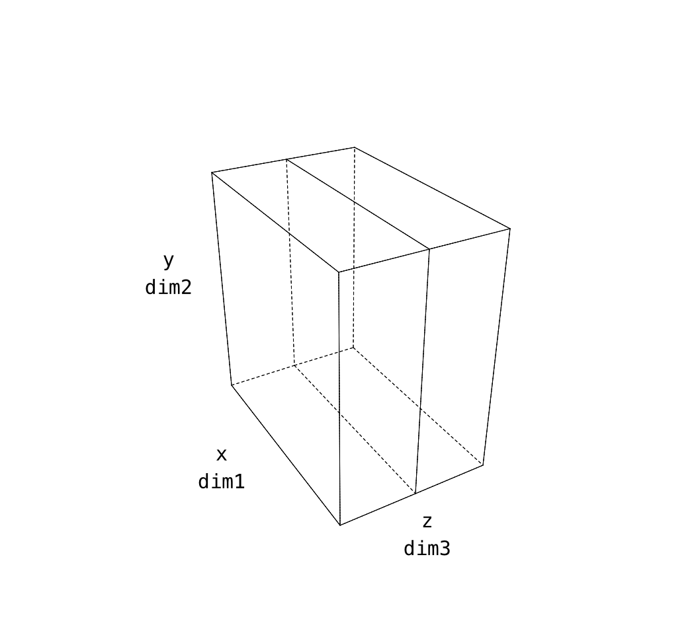
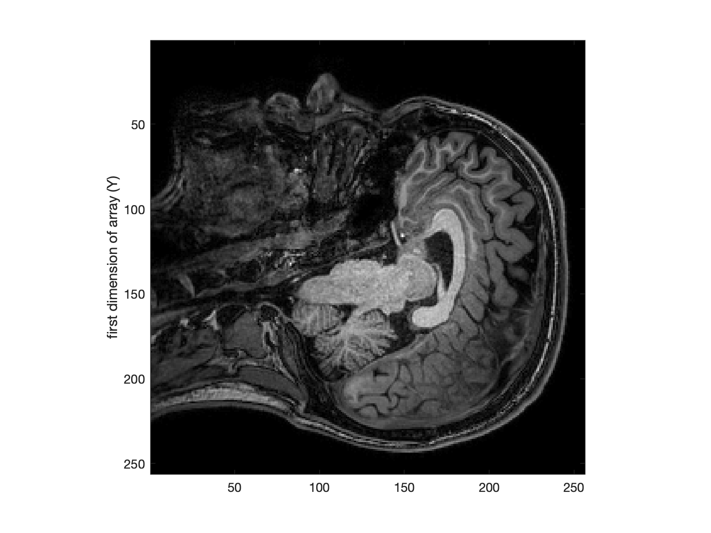
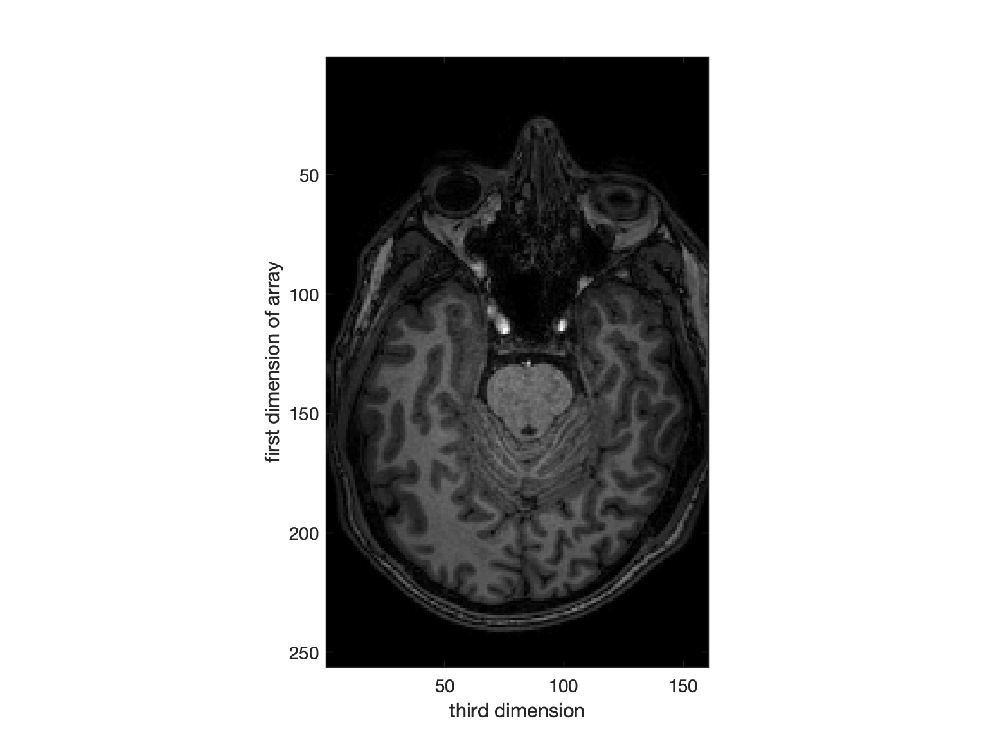
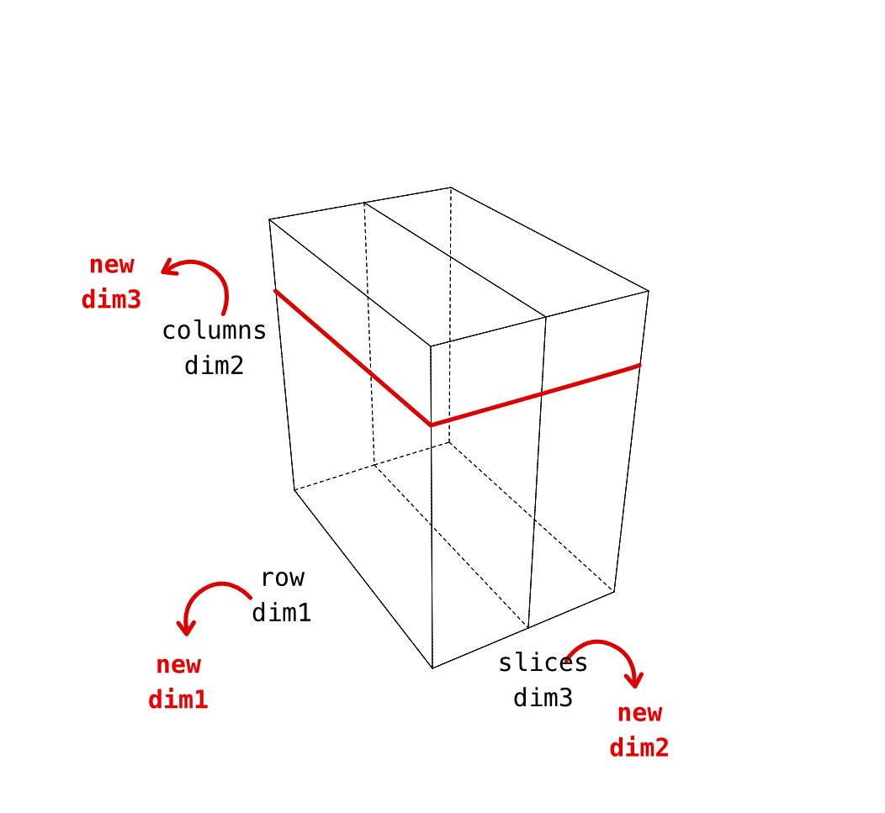

# Permuting dimensions

## Problem

Our images are stored in a 3d cube and the order is not quite what we want. The reason for this is that we acquired images in the sagittal direction. One way to think about this is that the "slowest" changing direction in the data collection was in that slice plane. In that way of thinking about image acquisition, the fastest and second fastest directions end up as X and Y respectively.

### by default

In our anatomical images, the dimensions are like this. **Note that even though we might be tempted to make the first image dimension X** that's not the case. The pixel display is arranged in the same way as you'd see the matrix display in text.

| data dimension | matlab data | plotting axis | anatomical          |
|:---------------|:------------|:--------------|:--------------------|
| 1              | "rows"      | y (!) not x   | anterior->posterior |
| 2              | "columns"   | x             | inferior->superior  |
| 3              | "slices"    | z             | right-left          |


<center>

</center>

```matlab
% load data
d = niftiread('dafni_01_FSL_7_1.nii');

% display a slice (which has 1st and 2nd dims)
figure, imagesc(d(:,:, 80));
ylabel('first dimension of array (Y)');
colormap(gray)
axis image
```

<center>

</center>

<hr>

To prove to yourself that this is the case, you can chop some of the data out along the first dimension (say half)... the effect on the image will reveal how Matlab plots data (and how your "intuitions" about x and y axes might be off :wink:).

```matlab
% display a slice (which has 1st and 2nd dims)
figure, imagesc(d(1:128,:, 80));
ylabel('first dimension of array (Y)');
title('first data dimension cut down to half')
colormap(gray)
axis image
```

<center>

</center>

<hr>

The third / final direction in the original image is *right-left*.

```matlab
% display a slice (which has 1st and 3rd dims)
 figure, imagesc(squeeze(d(:, 128, :)));
 ylabel('first dimension of array')
 xlabel('third dimension')
 colormap(gray)
 axis image
 ```

<center>

</center>

### the desired orientations

| data dimension | matlab data | plotting axis | anatomical                              |
|:---------------|:------------|:--------------|:----------------------------------------|
| 1              | "rows"      | y (!) not x   | anterior->posterior                     |
| 2              | "columns"   | x             | ~~inferior->superior~~  **right-left**  |
| 3              | "slices"    | z             | ~~right-left~~    **inferior-superior** |


<center>

</center>


**What does this all mean?** - conclusion of this detailed look is that the dimensions 2 and 3 in these anatomical images are in an order that makes the ``montage`` function not produce nice *axial slices*. We need to `permute` them.

```Matlab
dPermuted = permute(d, [1, 3, 2]);

figure, imagesc(dPermuted(:,:,80));
ylabel('first dimension of array')
xlabel('third dimension')
colormap(gray)
axis image

```
