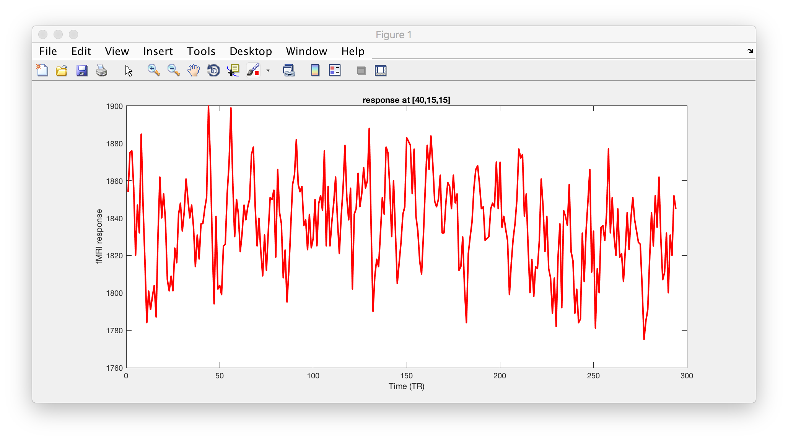
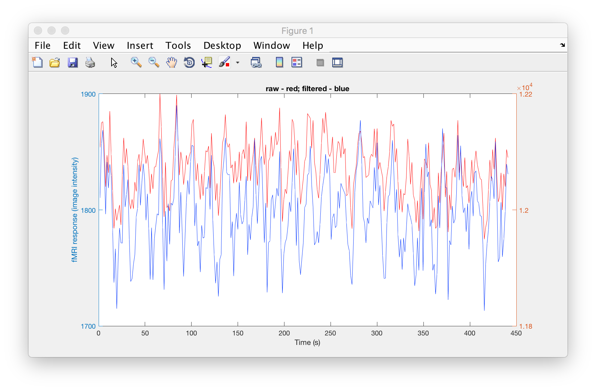
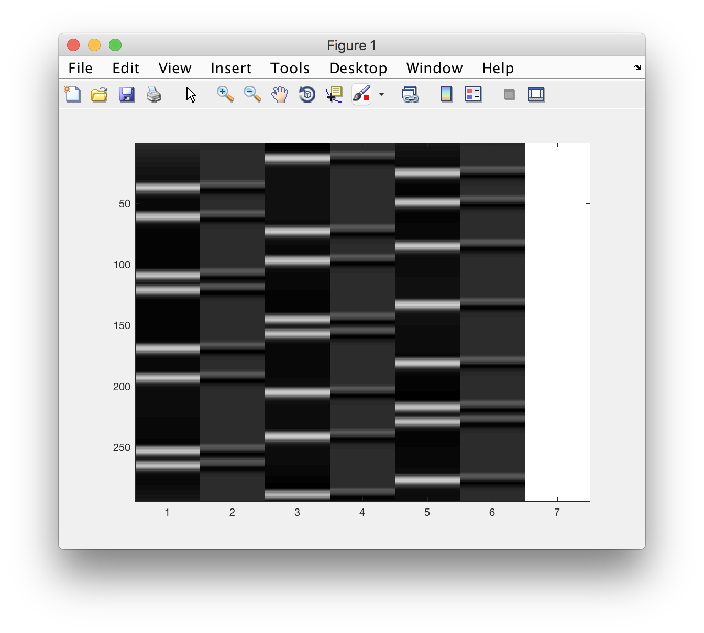

# Looking at time series - linear regression reprise

The aims of this lesson are:

  - answer any questions about ``makeMontage()`` program (last time)
  - ( revisit linear regression, GLM, ideas around analysing fMRI data. )
  - load in a text file that represents the design matrix ``X`` (as made by fsl/FEAT)
  - load in 4d image (nifti) and select out a particular voxel's timecourse - **plot/visualize**
  - load in timeseries for one particular voxel (output by `feat` analysis in `tsplot` folder)
  - (optional) write the code that will to the *linear regression*
  - (if time / for after class) look at how *t-stat* can be calculated, given residuals, design matrix and contrast vector.

>Rather than trying come up with a function that does all this, we will be working on a _script_, as you might do in an interactive analysis session.

## Data

I am assuming here, that you ran the `fsl` analysis on data from one of the subjects (A, B, C) in our 2019/20 cohort:

- we started with a file called ``CogNeuro03-301-WIP_MB2_TASKfMRI_singleechoTR2.nii``
- your ``fsl/feat`` directory will therefore be called: ``CogNeuro03-301-WIP_MB2_TASKfMRI_singleechoTR2.feat`` (*if not, adjust the follwing steps as necessary to grab the appropriate files*)

## A quick look at a statistical map and time series

Assuming you want to look at the results for the **faces** versus rest comparison, here is a one way using the interactive features of `fsleyes` et al

```bash
# go into the directory
cd CogNeuro03-301-WIP_MB2_TASKfMRI_singleechoTR2.feat
# load the filtered data... and superimpose the thresholded map in "hot", clipping
# values below 2.3 (within 2.3 std of 0). The `inf` means don't clip from above...
fsleyes filtered_func_data.nii.gz thresh_zstat1.nii.gz -cm hot -cr 2.3 inf &
```

**Open up a timeseries view**, too and then move your cursor around to inspect the fMRI data in the context of the statistical map. This allows you to hover around and identify intersting `[x,y,z]` locations in the dataset.

## Reading images into ``matlab``

We'll be using an example scan from the faces / objects / scenes scan. , so the file for subject ``C`` is ``CogNeuro03-301-WIP_MB2_TASKfMRI_singleechoTR2.nii``. You should also snoop around the ``CogNeuro03-301-WIP_MB2_TASKfMRI_singleechoTR2.feat`` folder that got created by FSL/FEAT -- we'll need this for the next step.

```matlab
% try out  - make sure you have ; at end of line
hdr = niftiinfo('CogNeuro03-301-WIP_MB2_TASKfMRI_singleechoTR2.nii')
data = niftiread('CogNeuro03-301-WIP_MB2_TASKfMRI_singleechoTR2.nii');
```

Inspect the variables ``hdr`` (a struct with many fields containing info) and ``data`` (a 4d array)

### and plot the time series

**In a small group** Think about the code you need to write to plot the timeseries at the following ``[x,y,z]`` location of the dataset we've loaded in with ``niftiread()`` just now:

```text
[45,16,12]
```

<details>
<summary>Hint 1 - Work out indexing</summary><p>

What's the indexing you need to fix one ``x`` value, one ``y`` value, and one ``z`` value - and get **all** values across time?
</p>

</details>

<details>
<summary>Hint 2 - Dimensions</summary><p>

An array that has size ``[1, 1, 1, 192]`` is still 4D in Matlab. What command do you need to make this the size ``[192]`` - 1D?

If you are stuck read the help on "singleton dimensions".

</p>
</details>


<details>
<summary>Solution</summary><p>

<pre>
<code>
data = niftiread('CogNeuro03-301-WIP_MB2_TASKfMRI_singleechoTR2.nii');
ts = squeeze( data(45,16,11,:) );  % nest, so it can go on 1 line

figure, plot(ts, 'r-', 'linewidth', 2)
xlabel('Time (TR)'); ylabel('fMRI response')
title('response at [45,16,12]')
</code>
</pre>
</p>
</details>


### A puzzle

The plot you will have produced in Matlab may look something like the following (the data here is actually from a previous run... so not perfectly the same, but the logic still counts:)




If you check back at the FSL/FEAT report for ``zstat1`` (now you can understand why I picked that particular coordinate!), you will see the following timeseries plot.


**Close, but not quite the same -- What is going on here??**

Adapt the following code to work with your dataset. What needs to change?

<details>
<summary>Hint 1</summary><p>

Data are often pre-processed. Which data is "raw", which may reflect some pre-processing?

</p>
</details>

<details>
<summary>Solutions</summary><p>

The data shown in the FSL/FEAT report is _not_ raw - but has been pre-processed (motion-corrected, temporally filtered, spatially blurred, ...). That intermediate data is by default stored in a nifti file called ``filtered_func_data`` 

<pre>
<code>
% specifying path also works!
hdr_f = niftiinfo('__WIP_fMRI_SENSE_20190215100331_401.feat/filtered_func_data.nii.gz');

data_f = niftiread('__WIP_fMRI_SENSE_20190215100331_401.feat/filtered_func_data.nii.gz');

ts_f = squeeze( data_f(40,15,15,:) );  % nest, so it can go on 1 line

figure, plot(ts_f, 'r-', 'linewidth', 2)
xlabel('Time (TR)'); ylabel('fMRI response')
title('*filtered* data at [40,15,15]')

% can also look at both of them at the same times:
% but note! different y-axes
t = hdr_f.PixelDimensions(4) .* (1:numel(ts_f)); % TR -> s
figure
[AX,H1,H2] = plotyy(t, ts, t, ts_f);
set(H1,'color', [1 0 0]);
set(H2,'color', [0 0.2 1]);
title('raw - red; filtered - blue')
xlabel('Time (s)')
ylabel('fMRI response (image intensity)')

</code>
</pre>
</p>
</details>



### * Ninja skill

Getting the timeseries for many voxels at the same time can be done by using a loop and going through a list of indeces. A more efficient way involves using *linear indexing* to convert ``[x,y,z]`` triplets into one number, say, ``idx``. If you are keen, have a look at ``sub2ind()`` and ``ind2sub()`` to see how this might work.

## Linear regression

First we need to grab the design matrix from FSL/FEAT. We could copy and paste from the text file for that analysis, but there is a neater way.

I called my analysis ``design.fsf`` when I ran FEAT on the faces / objects dataset (#4). FEAT spits out the design matrix in a slightly unusual format (VEST). There is an FSL command line tool to turn it into a text file. **In the Terminal**:

```bash
Vest2Text design.mat design.txt
```

Then we can use Matlab to load the design matrix.

```matlab
X = load('design.txt') % make sure the file is in the current folder!
% also add a column of ones!
X = [X, ones(size(X,1),1)];

% and inspect
figure, imagesc(X), colormap(gray)
```


And now for the linear regression:

```matlab
% solve (for beta):
% data = X * \beta + \epsilon

% little gotcha... ts is INTEGERS (ask DS for nitty gritty)

ts = double(ts); % turn into normal matlab numbers

beta = X\ts;
beta_f = X\ts_f; % the filtered version
```

We can now think about the beta weights - but also reconstruct the best linear fit:

```matlab
% model fit is beta weights times the column of X
model = X*beta; % matrix multiply!
model_f = X*beta_f;

residuals = ts - model;
residuals_f = ts_f - model_f; %just with filtered data
```


There is a lot more detail in the second section of the [Learning Matlab pages](http://schluppeck.github.io/learningMatlab/). Also we'll cover a little more next time.

## Plot...

Now let's see how close the linear prediction is to the data:

```matlab
figure
subplot(2,1,1)
plot(t,ts, 'k-', t, model, 'r-', 'linewidth',2)
xlabel('Time (s)'), ylabel('fMR image intensity')
title('Raw data')

subplot(2,1,2)
plot(t,ts_f, 'k-', t, model_f, 'r-', 'linewidth',2)
xlabel('Time (s)'), ylabel('fMR image intensity')
title('Voilà - filtered data')
```


### Notes for pre-2017b matlab

If you are trying this out in older versions of Matlab, ``niftiread()`` is not available. You could instead use the ``mrTools`` toolbox and use ``mlrImageReadNifti()`` to load `NIFTI` files:

```Matlab
which mlrImageReadNifti
% should return a valid path!
% if not, you'll need to run
addpath(genpath('/Volumes/practicals/ds1/mrTools'))
```
