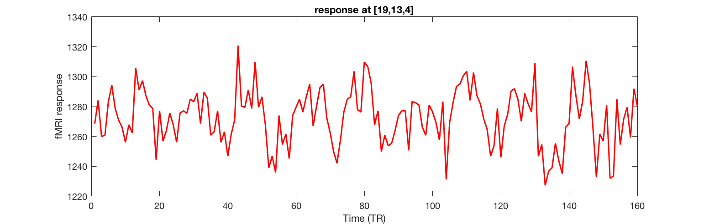
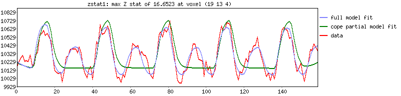
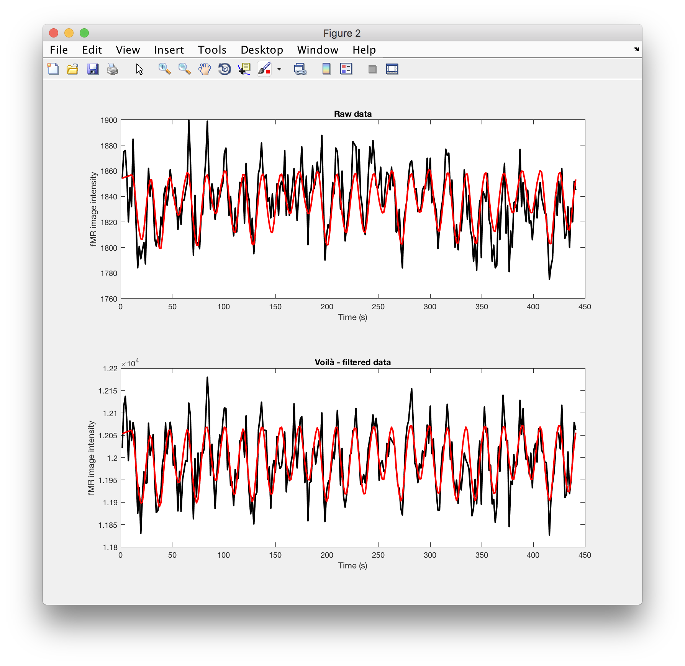

# Looking at time series - linear regression reprise

The aims of this lesson are:

  - show solution / approach for retro-fitting ``sliceview()`` program (last time)
  - load in a text file that represents the design matrix ``X`` (as made by fsl/FEAT)
  - load in 4d image (nifti) and select out a particular voxel's timecourse
  - write the code that will to the *linear regression*  
  - (if time / for after class) look at how *t-stat* can be calculated, given residuals, design matrix and contrast vector.

*We will be working on a script.*

## Reading images into ``matlab``

### paths, etc

As in the last session, make sure that the ``mrTools`` toolbox is on the path:

```Matlab
which mlrImageReadNifti
% should return a valid path!
% if not, you'll need to run
addpath(genpath('/Volumes/practicals/ds1/mrTools'))
```

### now load some data:

We'll be using an example scan from the faces / objects scan, so the file for ``S001`` is ``dafni_01_FSL_4_1.nii``. You should also snoop around the ``dafni_01_FSL_4_1.feat`` folder that got created by FSL/FEAT -- we'll need this for the next step.

```matlab
% try out  - make sure you have ; at end of line
[data hdr] = mlrImageReadNifti('dafni_01_FSL_4_1.nii');
```

### and plot the time series

**In a small group** Think about the code you need to write to plot the timeseries at the following ``[x,y,z]`` location of the dataset we've loaded in with ``mlrImageReadNifti()`` just before

```text
[19, 13, 4]
```

<details>
<summary>Hint 1 - Work out indexing</summary><p>

What's the indexing you need to fix one ``x`` value, one ``y`` value, and one ``z`` value - and get **all** values across time?

</details>

<details>
<summary>Hint 2 - Dimensions</summary><p>

An array that has size ``[1, 1, 1, 160]`` is still 4D in Matlab. What command do you need to make this the size ``[160]`` - 1D?

If you are stuck read the help on "singleton dimensions".

</p>
</details>


<details>
<summary>Solution</summary><p>

<pre>
<code>
[data hdr] = mlrImageReadNifti('dafni_01_FSL_4_1.nii');
ts = squeeze( data(19,13,4,:) );  % nest, so it can go on 1 line

figure, plot(ts, 'r-', 'linewidth', 2)
xlabel('Time (TR)'); ylabel('fMRI response')
title('response at [19,13,4]')
</code>
</pre>
</p>
</details>


### A puzzle

The plot you will have produced in Matlab may look something like the following.




If you check back at the FSL/FEAT report for ``zstat1`` (now you can understand why I picked that particular coordinate!), you will see the following timeseries plot.



**Close, but not quite the same -- What is going on here??**


<details>
<summary>Hint 1</summary><p>

Data are often pre-processed. Which data is "raw", which may reflect some pre-processing?

</details>

<details>
<summary>Solutions</summary><p>
  
The data shown in the FSL/FEAT report is _not_ raow - but has been pre-processed (motion-corrected, temporally filtered, spatially blurred, ...). That intermediate data is by default stored in a nifti file called ``filtered_func_data`` (it will be stored as a ``hdr/img`` pair)

<pre>
<code>
% specifying path also works!
[data_f hdr_f] = mlrImageReadNifti('dafni_01_FSL_4_1.feat/filtered_func_data.img');
ts_f = squeeze( data_f(19,13,4,:) );  % nest, so it can go on 1 line

figure, plot(ts_f, 'r-', 'linewidth', 2)
xlabel('Time (TR)'); ylabel('fMRI response')
title('*filtered* data at [19,13,4]')

% can also look at both of them at the same times:
% but note! different y-axes
t = hdr.pixdim(5) .* (1:numel(ts)); % TR -> s
figure, plotyy(t, ts, t, ts_f);

</code>
</pre>
</p>
</details>

### * Ninja skill

Getting the timeseries for many voxels at the same time can be done by using a loop and going through a list of indeces. A more efficient way involves using *linear indexing* to convert ``[x,y,z]`` triplets into one number, say, ``idx``. If you are keen, have a look at ``sub2ind()`` and ``ind2sub()`` to see how this might work.

## Linear regression

First we need to grab the design matrix from FSL/FEAT. We could copy and paste from the text file for that analysis, but there is a neater way.

I called my analysis ``analysis.fsf`` when I ran FEAT on the faces / objects dataset (#4). FEAT spits out the design matrix in a slightly unusual format (VEST). There is an FSL command line tool to turn it into a text file. **In the Terminal**:

```bash
Vest2Text analysis.mat analysis.txt
```

Then we can use Matlab to load the design matrix.

```matlab
X = load('analysis.txt') % make sure the file is in the current folder!
% also add a column of ones!
X = [X, ones(size(X,1),1)];

% and inspect
figure, imagesc(X), colormap(gray)
```

And now for the linear regression:

```matlab
% solve (for beta):
% data = X * \beta + \epsilon

beta = X\ts;
beta_f = X\ts_f; % the filtered version
```

We can now think about the beta weights - but also reconstruct the best linear fit:

```matlab
% model fit is beta weights times the column of X  
model = X*beta; % matrix multiply!
model_f = X*beta_f;

residuals = ts - model;
residuals_f = ts_f - model_f; %just with filtered data
```


There is a lot more detail in the second section of the [Learning Matlab pages](http://schluppeck.github.io/learningMatlab/). Also we'll cover a little more next time.

## Plot...

Now let's see how close the linear prediction is to the data:

```matlab
figure
subplot(2,1,1)
plot(t,ts, 'k-', t, model, 'r-', 'linewidth',2)
xlabel('Time (s)'), ylabel('fMR image intensity')
title('Raw data')

subplot(2,1,2)
plot(t,ts_f, 'k-', t, model_f, 'r-', 'linewidth',2)
xlabel('Time (s)'), ylabel('fMR image intensity')
title('Voilà - filtered data')
```


