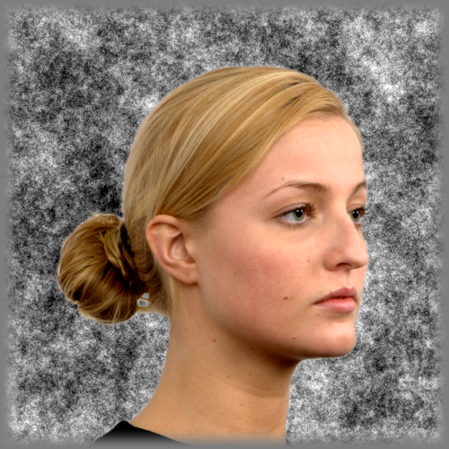
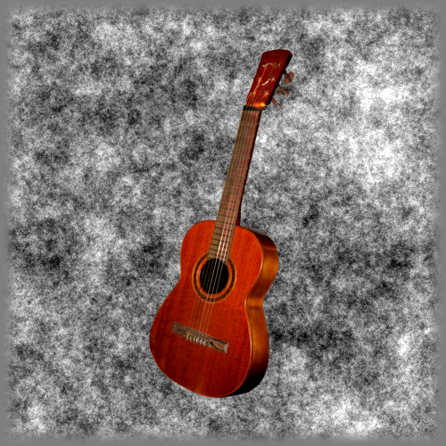

# stimulus details (2018)

The ``scene_localiser()`` experiment is a randomised block-design experiment.

There are blocks of ``faces``, ``objects`` and ``scenes`` that are displayed on a textured background, to minimize low-level visual confounds:

</img> </img> </img>

There are many studies that have used versions of this stimulus. Here we stick with the parameters used by Watson (@david_m_watson) and others. He also wrote the code for this version that runs under ``matlab`` and ``mgl``. See e.g. papers like the following to get a sense:

>Watson, D. M., Hartley, T., & Andrews, T. J. (2014). Patterns of response to visual scenes are linked to the low-level properties of the image. NeuroImage, 99, 402-410.

>Rice, G. E., Watson, D. M., Hartley, T., & Andrews, T. J. (2014). Low-level image properties of visual objects predict patterns of neural response across category-selective regions of the ventral visual pathway. Journal of Neuroscience, 34(26), 8837-8844.

## Timing

- TR=1500ms
- 294 dynamics (timpoints in total, 6 "dummies" at the start, followed by 288 dynamics after)
- each block was 9s OFF, followed by 9s stimulus
- order of blocks see [blockorder.txt](./blockorder.txt)
- order of stimulus images withing blocks see [blocklist.csv](./blocklist.csv)
- we'll look at plotting / displaying the **design matrix** for this experiment in class 6 / [Matlab 2](../../matlab-timeseries.md)
